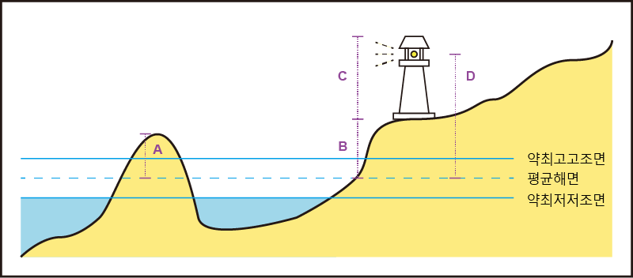

[[Height_Elevation_VerticalLength]]

= 높이의 구분

.Height, Elevation, VerticalLength

* 일반적으로 높이에 대한 수직기준면은 평균해면(MSL)을 사용한다.
** 평균해면이 아닌 다른 기준면을 사용하는 경우에는 이를 span:a[vertical datum]같은 속성으로 이를 명시해주어야 한다.
*** 예: 교량의 통과높이를 나타내는 span:A[vertical clearance] +
span:D[교량의 통과높이는 약최고고조면 기준]

//
**Height** :: 수직기준면(Vertical Datum)부터 구조물의 최상단(일반적으로 피뢰침, 두표같은 것은 제외)까지의 높이를 의미한다.

**Elevation** :: 수직기준면(Vertical Datum)부터 구조물 위치의 지면까지의 높이를 의미한다.

**VerticalLength** :: 구조물의 자체의 높이를 의미한다.

**A** :: (Elevation) 약최고고조면 이상의 노출암 등의 높이를 입력할 때에는 span:A[elevation]으로 입력

**B** :: (Elevation) 등대나 입표같은 구조물이 위치하는 높이를 입력할 때에는 span:A[elevation]으로 입력 +
span:D[일반적으로 등대표에서 이 값을 알 수 없으므로, 구조물에 elevation 값이 있다면 잘 못 입력된 값인지 확인해야 함]

**C** :: (VerticalLength) 등대나 입표같은 구조물의 높이(길이)를 입력할 때에는 span:A[vertical length]로 입력 +
span:D[등대표의 도색·구조·높이 열의 높이는 구조물의 높이를 의미함]

**B+C** :: (Height) 구조물의 최상단까지의 높이를 입력할 때에는 span:A[height]로 입력 +
span:D[B와 마찬가지로, 등대표에서는 확인할 수 없는 값이므로, 구조물에 height 값이 있다면 잘 못 입력된 값인지 확인해야 함]

**D** :: (Height) 등대나 등표같이 등화가 있는 경우, 등화의 높이는 span:F[Light All Around]나 span:F[Light Sectored]의 span:A[height]로 입력 +
span:D[간혹 등고를 구조물(예를 들어 Landmark)의 속성으로 잘 못 기입하는 경우가 있으므로, 주의 해야 함]

