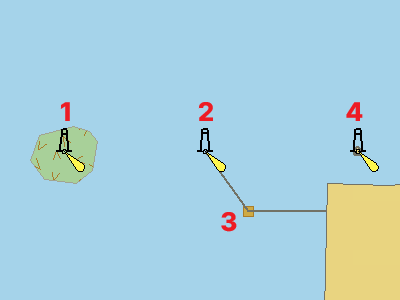

[[inTheWater]]

= in The Water 입력 조건

//

.in The Water의 정의
* 아래 대상 객체는 항해 가능한 수역이나 미측구역에 중첩(OVERLAP)되거나 덮힌(is COVERED BY)경우 span:A[in The Water] = (true)로 입력해야 함
* **대상 객체**가 어떤 Display Mode 일지라도 항상 표시되어야 하는 경우 span:A[in The Water] = (true)를 입력할 수 있음 (Case 2 ~ 4 공통)

//
.대상 객체

* 다음 객체가 조건에 해당됨.
** span:F[Building]
** span:F[Built Up Area]
** span:F[Crane]
** span:F[Fortified Structure]
** span:F[Landmark]
** span:F[Silo/Tank]
** span:F[Wind Turbine]

//
.항해 가능한 수역이나 미측구역

* 대상 객체가 다음 객체의 위에 있는 경우 span:A[in The Water] = (True)로 입력
** span:F[Depth Area]
** span:F[Dredged Area]
** span:F[Unsurveyed Area]

//
.예외

* 대상 객체가 다음 객체의 위에 있는 경우 span:A[in The Water] = (False) 또는 (Undefined) (※ Undefined를 권장함)
** span:F[Bridge] 
** span:F[Coastline] 
** span:F[Dam] 
** span:F[Dolphin] 
** span:F[Hulk] 
** span:F[Floating Dock] 
** span:F[Land Area] 
** span:F[Offshore Platform] 
** span:F[Pile] 
** span:F[Pontoon] 
** span:F[Pylon Bridge Support]
** span:F[Underwater Awash Rock]
** span:F[Shoreline Construction] with span:A[water level effect] = 1 span:D[partly submerged at high water] or 2 span:D[always dry]

//
.in The Water 인코딩 예시

Case 1 : 간출암 위에 등대를 입력::
* span:F[Landmark]가 span:F[Depth Area] 위에 있으므로 span:A[in The Water] = (True)

Case 2 : 방파제 위에 등대를 입력::
* span:F[Landmark]가 span:F[Shoreline Construction] 위에 있으므로 span:A[in The Water] = (False) 또는 (Undefined) (※ Undefined를 권장함)
* 단, span:F[Shoreline Construction]의 span:A[water level effect]는 (1 또는 2)이어야 함
* span:F[Landmark]는 span:F[Shoreline Construction]의 Node 위에 정확하게 입력해야함

Case 3 : 방파제 위에 건물을 입력::
* span:F[Building][P]이 span:F[Shoreline Construction][C] 위에 있으므로 span:A[in The Water] = (False) 또는 (Undefined) (※ Undefined를 권장함)
* 단, span:F[Shoreline Construction]의 span:A[water level effect]는 (1 또는 2)이어야 함
* span:F[Building]는 해당 위치의 span:F[Shoreline Construction]의 **Vertex**를 **Node**로 바꾸고 그 위에 정확하게 입력해야함

Case 4 : 노출암 위에 등대를 입력::
* span:F[Landmark][P]가 span:F[Land Area][P] 위에 있으므로 span:A[in The Water] = (False) 또는 (Undefined) (※ Undefined를 권장함)
* 절대로 span:F[Land Area][P]를 임의로 생성하지 않아야 함
