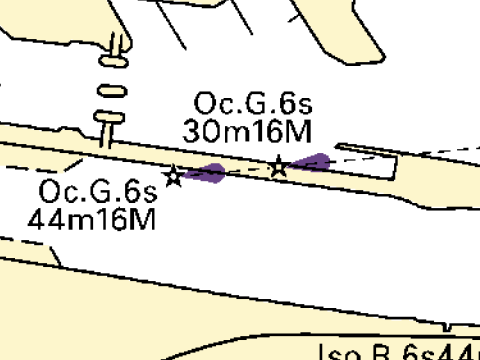
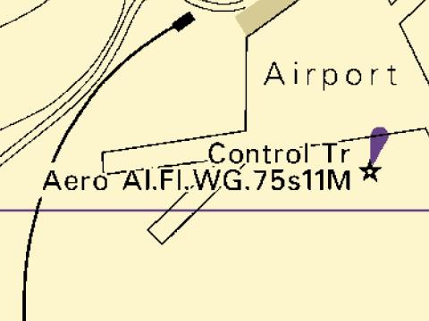
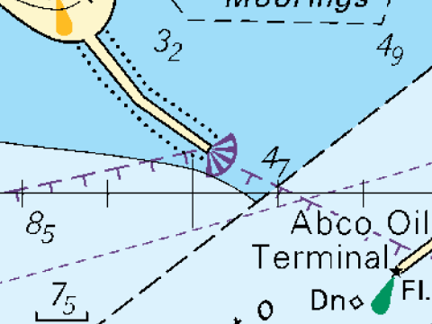
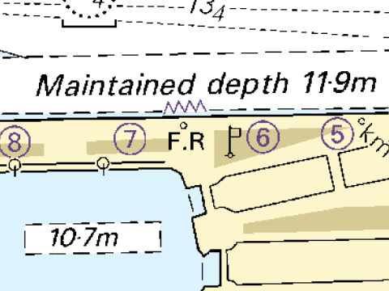
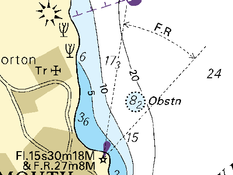
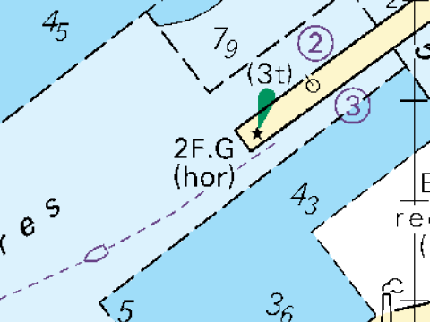
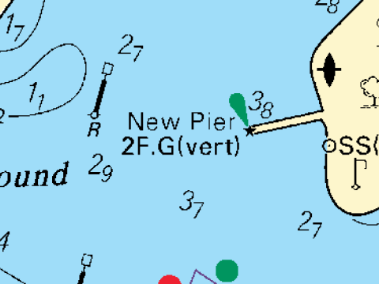

[[Lights_General]]

= 등화에 관한 일반적인 사항

. 등화(Lights)의 유형
+
* 전자해도에서 등화를 입력할 때, 등화의 유형에 따라 다음 객체를 사용해야 함
전방위등(Light All Around):: 
360도 모든 방향에서 동일한 등질을 가진 등화에 사용되며, 안개감지등과 항공장애등은 제외됨
분호등(Light Sectored):: 
서로 다른 등질을 가진 하나 이상의 분호(sector)가 있는 등화에 사용, 방향성이 있거나 일부 혹은 전체가 가려진 구역이 있는 등화를 포함함
안개감지등(Light Fog Detector):: 
안개로 인한 가시성 조건을 자동으로 감지하여 음향 신호를 켜거나 끄는 데 사용되는 등화
항공장애등(Light Air Obstruction):: 
항공 항법에 위험을 초래하는 장애물을 표시하는 등화

* 등화를 입력할 때, 등화의 특성과 목적을 평가하여 위 목록에서 가장 적합한 객체를 결정해야 함

. 등화의 리듬
+
* span:A[rhythm of light]을 입력할 때, 하위 속성인 span:A[signal group], span:A[signal period], span:A[signal sequence]는 **부동광이 아닌 경우** 즉, span:A[light characteristic] ≠ (1 : fixed)에만 적용되며, span:A[signal group], span:A[signal period]는 필수 항목임
* 이러한 하위 속성의 사용법은 아래 <<Lights_General_T1,표 - Rhythm of Lights의 속성입력 >>에 정의되어 있으며, 가장 일반적인 입력 예시를 포함함. ** 필요 시, 다른 속성 조합의 입력도 가능함
* 최근에 설치된 일부 등화는 야간에 항해자에게 "연성부동섬광(FFL,Fixed and flasing light)"로 보일 수 있지만, 실제로는 수직으로 배치된 두 개의 별도 등화, 즉 하나는 span:A[light characteristic] = (1 : fixed)이고 다른 하나는 (2 :flashing)로 구성되어 있을 수 있음
** 실제로 두 개의 등화가 별도로 존재하는 것으로 확인된 경우, 이를 단일 span:F[Light All Around]에 span:A[light characteristic] = (13 : fixed and flash)로 입력하지 말고, 각각 별도의 span:F[Light All Around]로 입력해야 함
** 이 경우 하나는 span:A[light characteristic] = (1 : fixed)로, 다른 하나는 span:A[light characteristic] = (2 : flashing)으로 입력해야 함

[[Lights_General_T1]]
.Rhythm of Light의 속성 입력
[cols="10,20,20", options="header"]
|===
|Rhythm of light |span:A[light characteristic] |span:A[signal group]
|F
| 1 : fixed
| prohibited
|Oc
| 8 : occulting
| (1)
|Oc(2)
| 8 : occulting
| (2)
|Oc(2+3)
| 8 : occulting
| (2+3)
|Iso
| 7 : isophased
| (1)
|Fl
| 2 : flashing
| (1)
|Fl(3)
| 2 : flashing
| (3)
|LFl
| 3 : long-flashing
| (1)
|Q
| 4 : quick-flashing
| (1)
|Q(3)
| 4 : quick-flashing
| (3)
|VQ
| 5 : very quick-flashing
| (1)
|VQ(3)
| 5 : very quick-flashing
| (3)
|UQ
| 6 : ultra quick-flashing
| (1)
|IUQ
| 11 : interrupted ultra quick flashing
| ()
|Mo(K)
| 12 : morse
| (K)
|FFl
| 13 : fixed and flash
| ()(1)
|Q(6)+LFl
| 25 : quick-flash plus long-flash
| (6)(1)
|VQ(6)+LFl
| 26 : very quick-flash plus long-flash
| (6)(1)
|Al.WR
| 28 : alternating
| ()
|Al.Fl.WR
| 19 : flash alternating
| (1)
|Al.Fl(2W+1R)
| 19 : flash alternating
| (2+1)
|Al.Oc(4)WR
| 19 : flash alternating
| (2+1)
|===

. 등화의 분류
+
* 등화의 유형과 기능으로 분류해야 하는 경우, span:A[category of light] 를 사용하여 입력해야 함

.category of light의 인코딩 예시
[cols="^20,^20,^30,<30", options="header"]
|===
| span:A[category of light] | S-4 | INT 1 ^|description
|4 : leading light 
| B-475.6
|  
| 다른 등화와 연결되어 도등 및 지도선을 형성하는 등화
|5 : aero light 
| B-476.1
|  
| 항공 항법을 위해 설치된 등화, 해상등보다 출력이 높고 해안에서 훨씬 멀리서도 볼 수 있음
|8 : flood light 
| B-478.2
|  
| 투광등, 구조물이나 구역을 비추는데 사용되는 광폭 등화
|9 : strip light 
| B-478.5
|  
| 선형등, 광원이 일반적으로 수평인 선형 형태를 가지며, 길이가 수 미터에 달할 수 있는 등화
|10 : subsidiary light 
| B-471.8
| 
| 주등대 위 또는 근처에 설치되어 항해에 특별한 용도가 있는 등화 +
주등대와는 구분하여 입력해야 함
|11 : spotlight 
| -
| - 
| 좁은 지역을 비추기 위해 초첨을 맞춘 강력한 등화 +
span:A[status] = 17 : illuminated)

|12 : front 
| B-470.7
| Front Lt 
| 도등에서의 전등, 4 : leading light 와 같이 사용 +
span:A[category of light] = (4, 12 - front leading light)
|13 : rear 
| B-470.7
| Rear Lt 
| 도등에서의 후등, 4 : leading light 와 같이 사용 +
span:A[category of light] = (4, 13 - rear leading light)
|14 : lower 
| B-470.7
| Lower Lt 
| 도등에서의 하등, 4 : leading light 와 같이 사용 +
span:A[category of light] = (4, 14 - lower leading light)
|15 : upper 
| B-470.7
| Upper Lt 
| 도등에서의 상등, 4 : leading light 와 같이 사용 +
span:A[category of light] = (4, 15 - upper leading light)
|17 : emergency 
| -
| -  
| 주등이 고장 날 경우 켜지는 주등의 백업 등
|18 : bearing light 
| S-4 B-478.1 +
_현재 사용되지 않음 + 
(Not currently used)_
| -
| 나침반을 사용하지 않고도 대략적인 방위를 얻을 수 있는 등화
|19 : horizontally disposed 
| B-471.8
|  
| 수평으로 배치된 동일한 등질과 위치의 등화군
|20 : veritically disposed 
| B-471.8
|  
| 수직으로 배치된 동일한 등질과 위치의 등화군
4+>| 그림 출처 : S-4 INT3 ed.1 (2023)
|===

. 도등의 입력
* 원 자료에서 도등이 단일 기호로 병합되어 표시되더라도, 각 등화에 대해 별도의 객체를 생성해야 함
* 이러한 등화는 실제 위치에 배치해야 하며, 예를 들어 원 자료에 **2F.Bu**와 같은 설명과 함께 단일 등화가 표시된 경우, 각 등화의 실제 위치와 전체 속성을 확인하기 위해 추가 조사가 필요함
* 해도제작 기술자는 종이해도에서 이와 같은 경우, 해도에 표시된 등화의 위치가 일반적으로 **도등에서 후등**에 해당한다는 점을 유의해야 함

. 등화의 높이
+
* 등대나 등표같이 등화가 있는 경우, 등화의 높이는 span:F[Light All Around]나 span:F[Light Sectored]의 span:A[height]로 입력 span:D[간혹 등고를 구조물(예를 들어 Landmark)의 속성으로 잘 못 기입하는 경우가 있으므로, 주의 해야 함]

. 등화의 점등 시간 및 조건
+
.exhibition condition of light 및 status의 인코딩 예시
[cols="^a,^a,^a" options="header"]
|===
| 점등 조건 | span:A[exhibition condition of light] | span:A[status]
|야간 등화
| 4 : night light
|
|무인 등화 
|
| 17 : unwatched
|비정기 등화
| 
| 2 : occasional
|비정기 등화 (사설)
|
| 2 : occasional +
8 : private
|24시간 점등 등화
| 1 : light shown without +
    change of character
|
|24시간 점등 등화 +
(주·야간 등질 변경)
<| 첫번째 등화 = 2 : daytime light +
두번째 등화 = 4 : night light +
(주·야간 등질을 각각의 관련 등화에 입력)
|
|안개 등화
| 3 : fog light
| 2 : occasional
.2+|안개 등화 +
(가시성 조건에 따른 등질 변경)
| 3 : fog light
| 2 : occasional
| 2 : daytime light +
4 : night light
<| span:A[infomation/text] +
"안개가 끼면 등질이 변경됨" +
"Character of the light changes in fog"
|===

. 수동 활성화 등화
+ 
* 라디오로 활성화되는 등화의 경우, span:A[signal generation] = (5 : radio)로 입력
* 관리소에 호출하여 활성화되는 등화의 경우, span:A[signal generation] = (6 : call activated)로 입력
* 등화 활성화를 위한 연락처 정보를 입력하려면 span:F[Contact Details]로 입력

:ObjectName: span:F[Contact Details]를
:Relation: span:R[Additional Information]
:linkTo: Additional_Information
include::../features_rules/common/phrase.adoc[tag=Refer, leveloffset=+2]