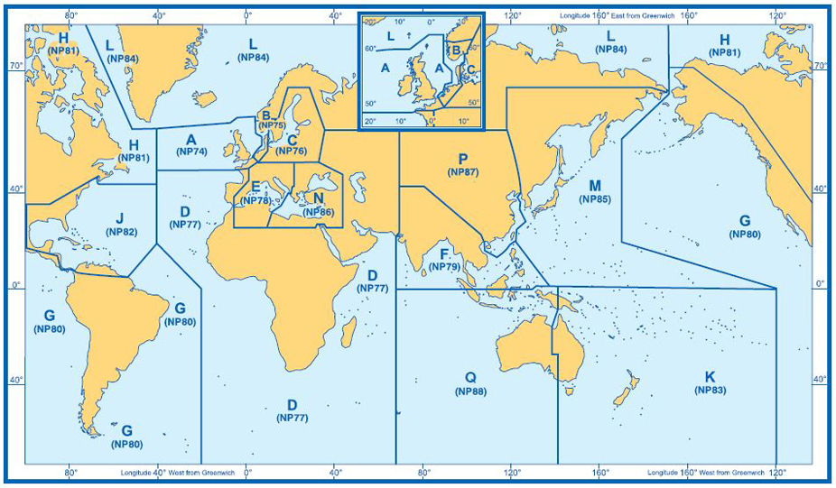

[[ListOfLights]]

= 등대표 보는법

.등대표 예시
[%header, cols="a,a,a,a,a,a,a,a"]
|===
^| 번&emsp;호 ^| 명&emsp;칭 ^| 위&emsp;치 ^| 등&emsp;질 ^| 등&emsp;고(m) ^| 광달거리 ^| 도색·구조·높이(m) ^| 기&emsp;사

<.^| 1201 +
 +
M4460
<.^| **저진** +
**도등(전등)** +
**Jeojin**
>.^| 38-33.16N +
128-24.50E
^.^| F W
^.^| 62
^.^| **24**
^.^| 백 4각 +
콘크리트조 +
35
<.^| 지도선(leading line) +
방위각 270°

^|(1)
^|(2)
^|(3)
^|(4)
^|(5)
^|(6)
^|(7)
^|(8)

|===

**(1)** 번호:: 항로표지는 우리나라 번호와 국제번호를 함께 표기한다. 국제번호는 영국 등대표에서 사용되는 번호를 준용하며, 국제번호 앞의 M은 우리나라 인근에 위치한 북서태평양(일본,러시아 등)의 항로표지를 의미한다. 특수항로표지인 레이더 비콘, 로란, 위성항법보정시스템, 무신호, 항공무선표지국 및 AIS 등은 4000번대 번호로 표기한다.

.참고 : 영국 등대표 권역별 구분

**(2)** 명칭:: 항로표지의 명칭은 한글과 영문을 함께 표기하며, 영문명은 로마자 표기법에 따른다.

**(3)** 위치:: 항로표지의 위치는 지리적 좌표(위도와 경도, WGS-84 타원체)로 표기하며, 해도에서 쉽게 찾을 수 있도록 도(°)와 분(′)으로 분 단위는 소수 2자리까지의 개략적인 위치를 표시한다.

**(4)** 등질:: 항로표지 등화의 특성인 등질, 등색, 주기 등을 세부적으로 표기하며, 자세한 설명은 제1장의 등대표 소개자료를 참조한다.

**(5)** 등고:: 등고는 평균 해수면에서 항로표지에 설치된 등화 중심부까지의 높이를 미터(m) 단위로 표기하며, 등선, 등부표, 부표 등은 일반적으로 높이가 거의 일정하여 그 높이를 표기하지 않는다.

**(6)** 광달거리:: 광달거리는 등화가 도달하는 최대거리를 말하며, 등대표에는 명목적 광달거리를 해리(해상마일, M)단위로 표기한다. 광달거리가 15M 이상인 것은 명칭과 광달거리를 진한 글씨체로 표기한다.

**(7)** 도색·구조·높이:: 항로표지 구조물의 색, 형태(모양, 재질), 높이 등을 표기하며, 높이는 지면(기초, 지반 제외)에서 구조물의 최상부(피뢰침, 두표 등 제외)까지를 미터(m) 단위로 표기한다.

**(8)** 기사:: 항로표지에 대한 보충 정보, 무신호 종류, 명호의 각도 등을 표기하며, 특히 명호의 각도는 해상(선박)에서 측정된 방위각으로 표기한다.

