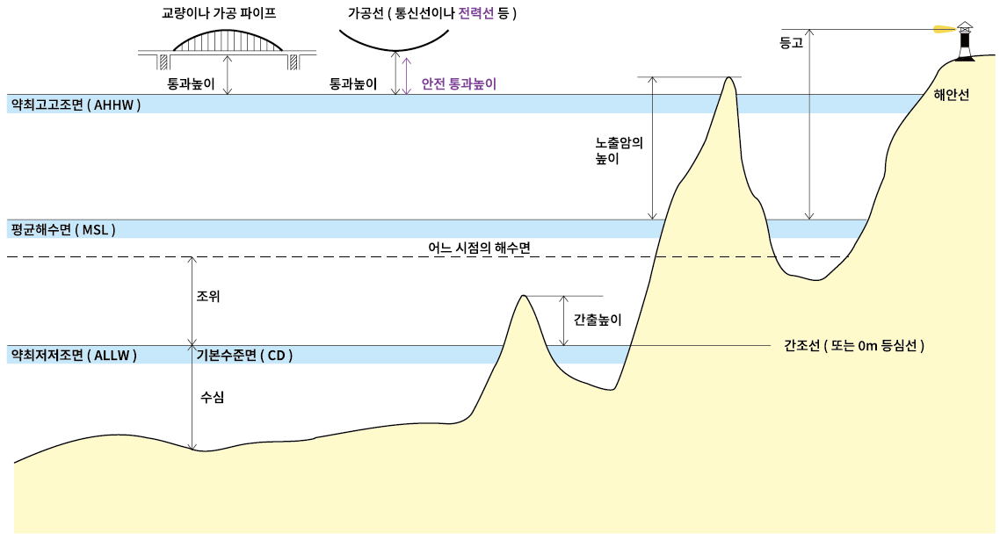

= 조위와 기준면

.조위와 기준면

//
수심:: **약최저저조면(ALLW)을 기준**으로 해저면까지의 수직거리

간출높이:: **약최저저조면(ALLW)을 기준**으로 간출암까지의 수직거리

노출암, 산 봉우리의 높이:: **평균해수면(MSL)을 기준**으로 노출암까지의 수직거리

교량, 가공파이프, 가공선의 통과높이:: **약최고고조면(AHHW)을 기준**으로 교량하부 또는 가공파이프, 가공선까지의 수직거리

span:M[안전통과높이]:: span:M[방전의 위험을 피하기 위한 안전 통과높이는 약최고고조면 상의 케이블의 물리적수직간격을 축소함으로써 얻어진다. 축소치는 가변적이며 송신전압에 따라 결정된다.]