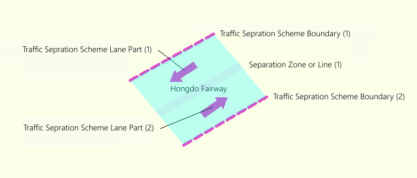
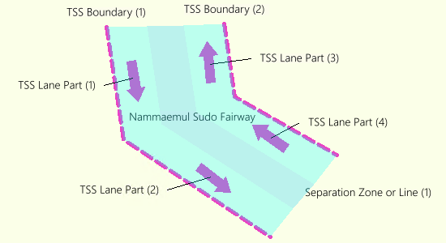
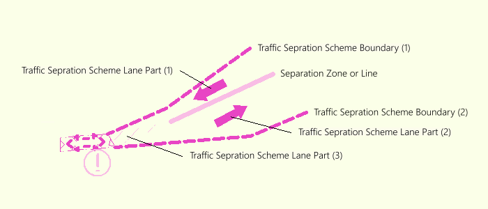
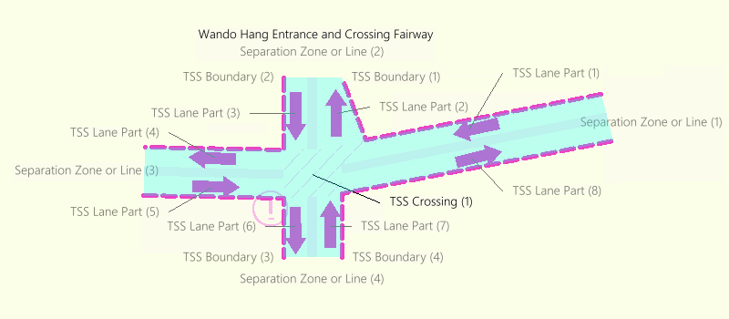
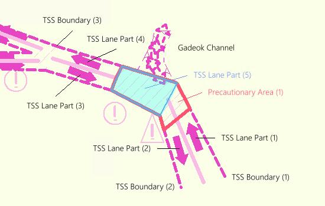

.Traffic Seperation Scheme Aggregation의 정의
[%header, cols="a,a,a,a"]
|===
4+h| Definition:: A feature association for the binding between a Traffic Separation Scheme or a Traffic Separation Scheme System and its component features.
h| Role Type h| Role h|Assiciated With h| Multiplicity

| Aggregation
| The Collection
| span:F[Traffic Separation Scheme]
| 0, 1

| Association
| The Component
| span:F[Deep Water Route], span:F[Deep Water Route Centreline], span:F[Deep Water Route Part], span:F[Inshore Traffic Zone], span:F[Precautionary Area], span:F[Restricted Area], span:F[Separation Zone or Line], span:F[Traffic Separation Scheme], span:F[Traffic Separation Scheme Boundary], span:F[Traffic Separation Scheme Crossing], span:F[Traffic Separation Scheme Lane Part], span:F[Traffic Separation Scheme Roundabout], span:F[Two-Way Route], span:F[Two-Way Route Part]
| 0, *
|===

===== Remark

* span:F[Traffic Separation Scheme] 을 입력할 때에는 **반드시** 1개 이상의 구성요소(정의에서 The Component 쪽 객체들)를 가져야 함
** 주의: 정의에서 The Component 쪽의 Multiplicity 가 ( 0, * ) 인 것은 개별 객체에 대한 제한임 +
   예를 들어, span:F[Traffic Separation Scheme Roundabout]이 **없는** 통항분리제도도 있을 수 있기 때문에, 개별 객체는 ( **0** , * )

===== Example

//REVIEW: 이런걸 Fairway 라고 해도 되나? Hongdo Route 같은게 더 적합하지 않을지?

.홍도항로 
====
* https://www.law.go.kr/%EB%B2%95%EB%A0%B9/%ED%95%B4%EC%83%81%EA%B5%90%ED%86%B5%EC%95%88%EC%A0%84%EB%B2%95%20%EC%8B%9C%ED%96%89%EA%B7%9C%EC%B9%99[**참고** - 해상교통안전법 시행규칙 중 별표20]

//
* span:F[Traffic Speation Scheme]와 구성요소 간 span:R[Traffic Speration Scheme Aggregation] 관계 설정
  **Collection**:: span:F[Traffic Speation Scheme][S] span:D[1개]
  **Component**:: span:F[Traffic Speration Scheme Boundary] span:D[2개], span:F[Traffic Seperation Scheme Lane Part] span:D[2개], span:F[Separation Zone or Line] span:D[1개]

---

====

.남매물수도 
====
* https://www.law.go.kr/%ED%96%89%EC%A0%95%EA%B7%9C%EC%B9%99/%EB%A7%A4%EB%AC%BC%EC%88%98%EB%8F%84%20%ED%95%AD%ED%96%89%EC%95%88%EC%A0%84%EC%97%90%20%EA%B4%80%ED%95%9C%20%EA%B3%A0%EC%8B%9C[**참고** - 매물수도 항행안전에 관한 고시]

//
* span:F[Traffic Speation Scheme]와 구성요소 간 span:R[Traffic Speration Scheme Aggregation] 관계 설정
  **Collection**:: span:F[Traffic Speation Scheme][S] span:D[1개]
  **Component**:: span:F[Traffic Speration Scheme Boundary] span:D[2개], span:F[Traffic Seperation Scheme Lane Part] span:D[4개], span:F[Separation Zone or Line] span:D[1개]

//
* 통항구간의 방위각이 바뀌기 때문에 span:F[Traffic Seperation Scheme Lane Part]를 구분하여 입력 +
  span:F[Traffic Speration Scheme Boundary]나 span:F[Separation Zone or Line]는 구분하지 않음

---

====

.포항항(신항) 항로 - 합류 구역(Junction Area)이 있는 경우
====
* https://www.law.go.kr/%ED%96%89%EC%A0%95%EA%B7%9C%EC%B9%99/%ED%8F%AC%ED%95%AD%ED%95%AD%20%ED%95%AD%EB%A7%8C%EC%8B%9C%EC%84%A4%20%EC%9A%B4%EC%98%81%EC%84%B8%EC%B9%99/[**참고** - 포항항 항만시설 운영세칙]

//
* span:F[Traffic Speation Scheme]와 구성요소 간 span:R[Traffic Speration Scheme Aggregation] 관계 설정
  **Collection**:: span:F[Traffic Speation Scheme][S] span:D[1개]
  **Component**:: span:F[Traffic Speration Scheme Boundary] span:D[2개], span:F[Traffic Seperation Scheme Lane Part] span:D[3개], span:F[Separation Zone or Line] span:D[1개]

//
* 그림에서 span:F[Traffic Seperation Scheme Lane Part](3) 'Junction Area' 에 해당하는 객체는 span:A[orientation value] 값을 입력하지 않아야 함
** span:A[information]을 이용하여, 합류 구역(Junction Area)임을 표시

---

[source,yaml]
----
Traffic Separtion Scheme Lane Part(3): # Surface Type
  # 'orientation' MUST BE OMITTED (Undefined)
  information:
    language: eng
    text: Junction Area
  information:
    language: kor
    text: 합류 구역
----

====

.완도 출입 및 횡단항로 - 교차 구역(Crossing)이 있는 경우
====
* https://www.law.go.kr/%ED%96%89%EC%A0%95%EA%B7%9C%EC%B9%99/%EC%99%84%EB%8F%84%ED%95%AD%20%EC%9D%B8%EA%B7%BC%ED%95%B4%EC%97%AD%20%ED%95%AD%ED%96%89%EC%95%88%EC%A0%84(%EC%A7%80%EC%A0%95%ED%95%AD%EB%A1%9C)%EC%97%90%20%EA%B4%80%ED%95%9C%20%EA%B3%A0%EC%8B%9C[**참고** - 완도항 인근해역 항행안전(지정항로)에 관한 고시]

//
* span:F[Traffic Speation Scheme]와 구성요소 간 span:R[Traffic Speration Scheme Aggregation] 관계 설정
  **Collection**:: span:F[Traffic Speation Scheme][S] span:D[1개]
  **Component**:: span:F[Traffic Speration Scheme Boundary] span:D[4개], span:F[Traffic Seperation Scheme Lane Part] span:D[8개], span:F[Traffic Sepration Scheme Crossing] span:D[1개], span:F[Separation Zone or Line] span:D[4개]

//
* span:F[Traffic Separation Scheme Crossing]은 이 예시와 같이 항로가 **교차**하는 경우에만 사용

---

====

//REVIEW: 국내에는 이 예시에 들어맞는 곳이 없음; 
// .??? - 회전 교차 구역(Roundabout)이 있는 경우
// ====
// 
// ====

.(부산항) 가덕수도 - 주의해역(Precautionary Area)이 있는 경우
====
* https://www.law.go.kr/%ED%96%89%EC%A0%95%EA%B7%9C%EC%B9%99/%EB%B6%80%EC%82%B0%ED%95%AD%20%ED%95%AD%EB%B2%95%20%EB%93%B1%EC%97%90%20%EA%B4%80%ED%95%9C%20%EA%B7%9C%EC%B9%99[**참고** - 부산항 항법 등에 관한 규칙]

//
* span:F[Traffic Speation Scheme]와 구성요소 간 span:R[Traffic Speration Scheme Aggregation] 관계 설정
  **Collection**:: span:F[Traffic Speation Scheme][S] span:D[1개]
  **Component**:: span:F[Traffic Speration Scheme Boundary] span:D[3개], span:F[Traffic Seperation Scheme Lane Part] span:D[5개], span:F[Separation Zone or Line] span:D[2개], span:F[Precautionary Area] span:D[1개]

//
* 고시에서 주의해역에 관해 명시하고 있기 때문에, span:F[Precautionary Area]로 입력
** **주의**: span:F[Precautionary Area]를 입력하더라도, span:F[Traffic Separation Scheme Lane Part]를 생략해서는 안 됨 +
   _(그림에서 빨간색으로 표현된 Precautionary Area와 파란색으로 표현된 Traffic Separation Scheme Lane Part 참고)_
** 주의해역에 관한 속력제한이 있다면, span:F[Precautionary Area]의 span:A[restriction] 및 span:A[vessel speed limit]로 입력
*** 이 경우 span:F[Traffic Separation Scheme Lane Part]에는 span:A[restriction] 및 span:A[vessel speed limit] 입력하지 않음

---

//REVIEW: information 내용을 수정해야 하나? 12노트 이하로 항행하여야 한다.를 포함하도록 ㄷㄷㄷ
[source, yaml]
----
PrecautionaryArea: # Surface Type
  restriction: 27 # (speed restricted)
  vesselSpeedLimit:
    speedLimit: 12
    speedUnit: 4 # (Knots)
  information:
    language: eng
    text: PRECAUTIONARY AREA(This area may be congested or ships may cross navigate, so mariners are advised to navigate with caution.)
  information:
    language: kor
    text: 주의해역(이 구역은 선박이 밀집되거나 교차 항해의 우려가 있으므로 주의하여 항행하여야 함.)
----
====

