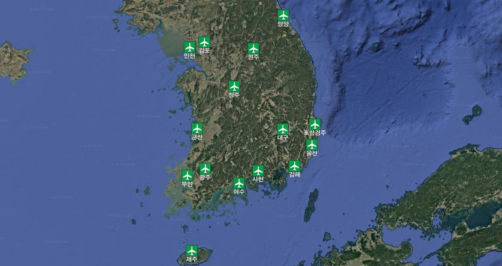

// tag::AirportAirfield[]
===== Remark

* 해안에 인접한 공항은 span:F[Airport/Airfield] 로 입력
* 공항 입력 시 범주에 맞게 span:A[category of airport/airfield] 을 필수로 입력
* 대축척 전자해도의 경우, 공항은 다음 객체들을 조합하여 인코딩할 수 있음;
span:F[Airport/Airfield][S], span:F[Runway][C,S], span:F[Building][P,S], span:F[Landmark][P,S]. 
** 이 조합에는 최소한 하나의 span:F[Airport/Airfield] 또는 span:F[Runway][C,S]가 포함되어야 함
* 헬기 이착륙장은 span:F[Helipad]로 입력

.국내 공항 위치

===== Example

.Airport/Airfield의 인코딩 예시
[cols="30,25,10,10,25", options="header"]
|===
|Attribute |Acronym |Type |Mult. |Value

|category of airport/airfield|CATAIR|EN|0,*| 2 : civil aeroplane airport
|**feature name**||C|0,*| 
|    span:E[language]||(S)TE|1,1| eng 
|    span:E[name]|OBJNAM/NOBJNM|(S)TE|1,1| Incheon International Airport
|    name usage||(S)EN|0,1| 1 : default name display 
|**feature name**||C|0,*| 
|    span:E[language]||(S)TE|1,1| kor
|    span:E[name]|OBJNAM/NOBJNM|(S)TE|1,1| 인천국제공항 
|    name usage||(S)EN|0,1| 2 : alternate name display
|===

---
// end::AirportAirfield[]
