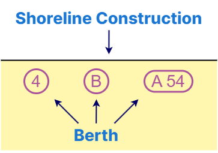

// tag::Berth[]
===== Remark

* span:F[Berth]는 반드시 span:F[Shoreline Construction]과 인접하여 선박이 계류할 수 있는 장소가 되어야 함
* span:F[Berth]의 span:A[feature name]은 필수 속성이므로 선석 이름 또는 번호를 반드시 입력
* span:A[horizontal clearance length], span:A[horizontal clearance width]는 고시된 정보를 사용해야하며, 선박이 통항 가능한 여유 길이와 폭을 입력
* span:A[minimum berth depth], span:A[maximum permitted draught]는, 가장 얕은 물리적 깊이와 허용된 최대 흘수를 각각 입력

===== Example

.Berth의 인코딩 예시
[cols="30,25,10,10,25", options="header"]
|===
|Attribute |Acronym |Type |Mult. |Value

|**feature name**||C|1,*| 
|    span:E[language]||(S)TE|1,1| eng
|    span:E[name]|OBJNAM/NOBJNM|(S)TE|1,1| 2
|    name usage||(S)EN|0,1|  1 : default name display

|===

---
// end::Berth[]
