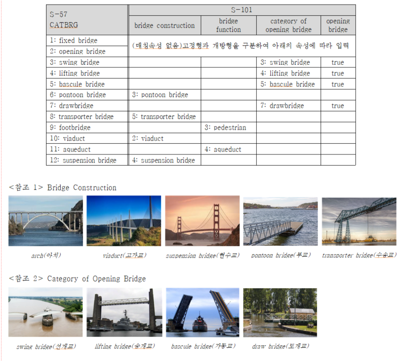
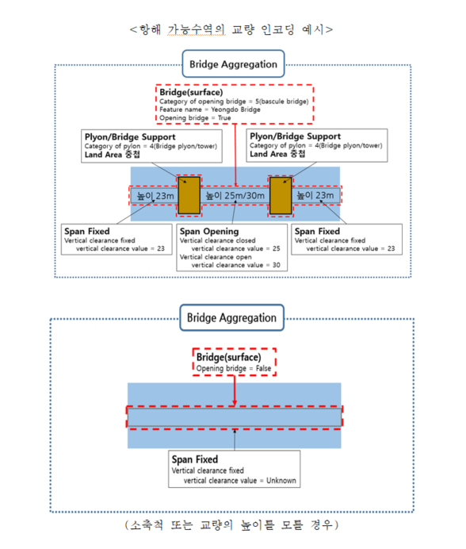
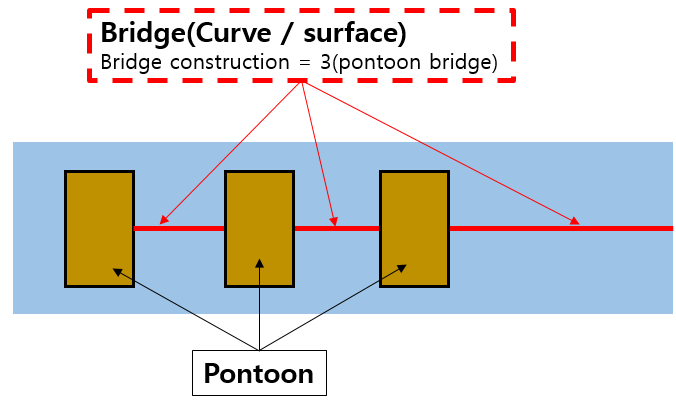

=== 일반기준
- 교량은 항해 불가능한 지역(Land area)과 항해가능지역(Depth area, Dredged Area, Unsurveyed area)에 모두 입력 가능
- S-57 전자해도의 속성 [CATBRG]의 1(fixed bridge), 2(opening bridge)는 “Span Fixed”와 “Span Opening”으로 구분하여 인코딩하고 아래의 표를 참조하여 속성입력

항해 가능 지역의 교량
- 항해 가능한 지역의 고정형(Span Fixed), 개방형(Span Opening) 교량은 교량의 모든 구성요소를 포함하는 Surface type의 “Bridge”를 생성하고 관련된 Feature는 {Bridge Aggregation} 관계 설정
    (교량에 대한 명칭이나 정보는 “Bridge”에 입력)
    ※ Relation 페이지 참조
- “Span Opening”을 포함하는 {Bridge Aggregation}은 속성 [Opening bridge], [Category of opening bridge] 필수 입력
- 교량 수직높이는 “Span Fixed”와 “Span Opening”의 [Vertical clearance]에 필수 입력하며, 아래 그림과 같이 높이 값에 따른 각각의 피처를 생성

항해 불가능한 지역의 교량
- 항해 불가능한 지역(Land area, Pontoon Bridge등)의 교량은 Curve / Surface type의 “Bridge”로 인코딩하며 별도의 교량 관련 {Bridge Aggregation} 설정은 생략

