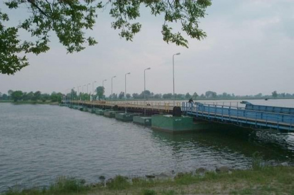
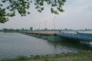
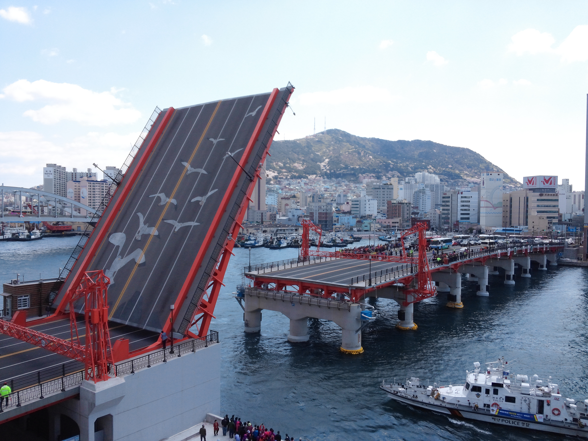
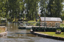

// tag::Bridge[]
===== Remark

* 교량은 항해 불가능한 지역과 항해 가능 수역에 모두 입력 가능
--
 항해 불가능 지역 : #F "Land Area"
 항해 가능 수역 : #F "Depth Area", #F "Dredged Area", #F "Unsurveyed Area"
--
* 교량를 입력하는 상황은 다음 두가지로 나뉨 +
--
 #F "Span Fixed" 또는 #F "Span Opening" 없이 단독으로 #F "Bridge"(C,S)를 입력하는 경우
 #R "Bridge aggregation"을 맺기 위해 #F "Bridge"(C,S,N)를 입력하는 경우 
--

--
&nbsp;
--

* 단독 #F "Bridge"(C,S)의 입력 조건
** 항해가 가능하거나 항해가 불가능한 수역에서 모두 사용
** 교량을 #F "Span Fixed", #F "Span Opening" 등 구성 객체로 사용하여 자세히 표현하기 어려울 때 사용
** #F "Pontoon"의 연결 다리에 사용
** 강 또는 하천과 같이 항해가 불가능한 수역에 사용
** #R "Bridge aggregation" 없이 #F "Bridge"(C,S) 만 입력

--
&nbsp;
--

* #R "Bridge aggregation"을 맺기 위해 #F "Bridge"(C,S,N)를 입력하는 경우 
** 이 경우 #A "opening bridge" 는 필수, (True , False)를 선택해서 입력
** #R "Bridge aggregation"을 정의하기 위해 구성 객체와 #F "Bridge"로 객체 관계를 맺어야함
** 고정 경간은 #F "Span Fixed"로, 개방 경간은 #F "Span Opening"으로, 교각은 #F "Pylon/Bridge Support"로 #F "Bridge"와 구분하여 입력해야 함
** #F "Bridge"의 공간적 범위는 #F "Span Fixed" 또는 #F "Span Opening" 들의 전체 범위를 포함해야함 (#F "Pylon/Bridge Support", #F "Pontoon"의 공간적 범위는 제외)
** #R "Bridge aggregation"은 최소한 하나의 구성 객체를 반드시 포함해야함
** #R "Bridge aggregation"의 구성 객체는 같은 #A "scale minimum" 값을 가져야 함
** #R "Bridge aggregation"의 구성에 #F "Span Opening"가 포함되면 #A "opening bridge" = true 로 입력하고, #A "category of opening bridge" 를 필수로 입력해야함

.bridge construction의 예시
[cols="1,1,1,1,1" , frame=none, grid=none]
|===
|image:../images/Bridge/Bridge_image-1.png[width=100] 
|image:../images/Bridge/Bridge_image-2.png[width=100]
|image:../images/Bridge/Bridge_image-3.png[width=100] 
| 
|

|arch |viaduct |suspension bridge |pontoon bridge |transporter bridge
|===

.category of opening bridge의 예시
[cols="1,1,1,1" , frame=none, grid=none]
|===

|image:../images/Bridge/Bridge_image-6.png[width=100] 
|image:../images/Bridge/Bridge_image-7.png[width=100] 
| 
|

|swing bridge |lifting bridge |bascule bridge |draw bridge
|===

.개방 교량의 공간적 범위 인코딩 예시
image::../images/Bridge/Bridge_image-10.png[width=400] 

===== Example

.고정 교량의 인코딩 예시
[cols="30,25,10,10,25", options="header"]
|===
|Attribute |Acronym |Type |Mult. |Value

|bridge construction|CATBRG|EN|0,1| 1 : arch
|bridge function|CATBRG|EN|0,*| 1 : vehicular 
|bridge function|CATBRG|EN|0,*| 3 : pedestrian
|condition|CONDTN|EN|0,1| 1 : Under Construction
|**feature name**||C|0,*| 
|    #essential language||(S)TE|1,1| eng
|    #essential name|OBJNAM/NOBJNM|(S)TE|1,1| Busan Bridge
|    name usage||(S)EN|0,1|1 : default name display
|**feature name**||C|0,*| 
|    #essential language||(S)TE|1,1|kor
|    #essential name|OBJNAM/NOBJNM|(S)TE|1,1| 부산대교
|    name usage||(S)EN|0,1|2 : alternate name display 
|opening bridge||(S)BO|0,1|false
|===

.개방 교량의 인코딩 예시
[cols="30,25,10,10,25", options="header"]
|===
|Attribute |Acronym |Type |Mult. |Value

|bridge construction|CATBRG|EN|0,1| 1 : arch
|bridge function|CATBRG|EN|0,*| 1 : vehicular 
|bridge function|CATBRG|EN|0,*| 3 : pedestrian
|category of opening bridge|CATBRG|EN|0,1| 5 : bascule bridge
|condition|CONDTN|EN|0,1| 1 : Under Construction
|**feature name**||C|0,*| 
|    #essential language||(S)TE|1,1| eng
|    #essential name|OBJNAM/NOBJNM|(S)TE|1,1| Yeongdo Bridge
|    name usage||(S)EN|0,1|1 : default name display
|**feature name**||C|0,*| 
|    #essential language||(S)TE|1,1|kor
|    #essential name|OBJNAM/NOBJNM|(S)TE|1,1| 영도대교
|    name usage||(S)EN|0,1|2 : alternate name display 
|opening bridge||(S)BO|0,1|true
|===

---
// end::Bridge[]
