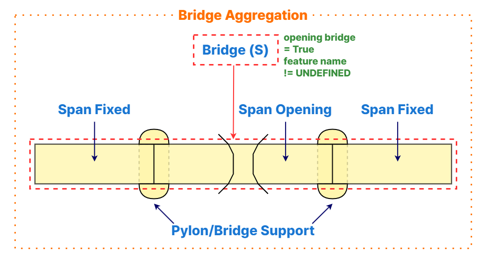
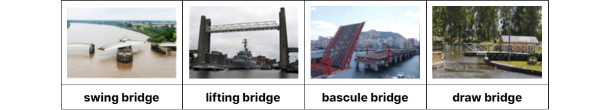
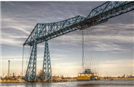
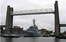
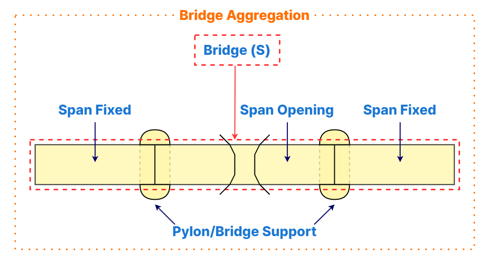

// tag::Bridge[]
===== Remark

* #F "Bridge"는 항해 가능 여부와 관계없이 모든 수역 및 육지에서 입력이 가능함
* #F "Bridge"은 상세 수준과 맥락에 따라 단독 객체로 입력하거나 교량 집합(#R "Bridge aggregation")으로 구성할 수 있음
--
&nbsp;
--
* 단독 교량 (#F "Bridge"(C,S))

단독 교량은 #R "Bridge aggregation" 없이 #F "Bridge"(C,S)로, 이는 상세한 표현이 어렵거나 필요하지 않은 경우에 사용됨

* 사용 조건
** #A "optimum display scale"에 해당하는 화면 축척에서 #F "Span Fixed" 또는 #F "Span Opening"과 같은 구성 객체로 교량을 상세히 표현하기 어려운 경우.
** #F "Pontoon"으로 구성된 연결 교량인 경우.
** 해안선 부근, 강, 하천 등 항해가 불가능한 지역인 경우.

* 필수 속성
** #A "feature name": 교량의 이름을 입력
** #A "opening bridge": 개방 가능 여부를 나타내는 필수 속성으로, `True` 또는 `False` 값을 선택해야 함.
--
&nbsp;
--
* 교량 집합 (#R "Bridge aggregation")

#R "Bridge aggregation"은 대표 객체 #F "Bridge"(C,S,N)를 사용하여 항해 가능한 수역에서 상세히 입력할 때 사용됨. 이는 구성 객체를 통해 교량의 구조를 자세히 표현할 수 있는 경우에 적용됨

* 사용 조건
** 항해 가능한 수역에서 구성 객체를 사용하여 교량을 상세히 입력할 수 있는 경우.
** 집합체는 다음을 포함해야 함:
*** 대표 객체로 #F "Bridge"(C,S,N).
*** 최소한 하나의 #F "Span Fixed" (고정 경간) 또는 #F "Span Opening" (개방 경간).
*** 관련이 있는 경우, #F "Pylon/Bridge Support" (교각) 또는 #F "Pontoon" (부교)을 선택적으로 포함.
*** 고정 경간은 #F "Span Fixed", 개방 경간은 #F "Span Opening", 교각은 #F "Pylon/Bridge Support"로 #F "Bridge"와 구분하여 입력.

* 필수 속성
** #A "opening bridge": 개방 가능 여부를 나타내는 필수 속성으로, `True` 또는 `False` 값을 선택해야 함.
*** 집합에 #F "Span Opening"이 포함된 경우, #A "opening bridge" = (True)로 설정하고, #A "category of opening bridge"를 필수로 입력해야 함.
** 교량 이름:
*** 교량 이름이 알려져 있고 #A "feature name"에 입력할 경우, #F "Bridge"(C,S)를 사용.
*** 교량 이름이 알려지지 않았거나 입력할 필요가 없는 경우, #F "Bridge"(N)를 사용.
** 공간적 범위:
*** #F "Bridge"(C,S)의 공간적 범위는 관련된 #F "Span Fixed" 및 #F "Span Opening" 의 전체 범위를 포함해야 함.
*** 국내 기준 : 작업의 편의를 위해 #F "Pylon/Bridge Support" 및 #F "Pontoon"의 공간적 범위는 제외됨.
*** 교량 집합(#R "Bridge aggregation")의 구성 객체에서 제외하라는 의미가 아님
** #A "scale minimum": #R "Bridge aggregation"에 포함된 모든 객체는 동일한 #A "scale minimum" 값을 가져야 함.

.개방 교량의 공간적 범위 입력

* 부가 정보
** 추가 정보는 #A "information" 또는 #F "Nautical Information"을 사용하여 입력.
** 항해 안전과 관련된 내용은 #F "Caution Area"를 사용.

* 주요 요구사항 요약
** 단독 #F "Bridge"(C,S)는 간단하거나 항해 불가능한 경우에 사용되며, #A "opening bridge"가 필수.
** #R "Bridge aggregation"은 항해 가능한 수역에서 상세 입력을 위해 #F "Bridge"(C,S,N)를 사용하며, 최소한 하나의 #F "Span Fixed" 또는 #F "Span Opening"을 포함.
** 집합체 내 모든 객체는 동일한 #A "scale minimum" 값을 공유해야 함.
** #F "Bridge"(C,S)의 공간적 범위는 모든 경간을 포함하되, 교각과 부교는 제외.
** 항해 안전 및 부가 정보는 특정 속성 또는 객체를 통해 처리.

.bridge construction의 예시
[cols="1,1,1,1,1" , frame=none, grid=none]
|===
| 
|
| 
|image:../images/Bridge/Bridge_image-5.jpg[width=100%] 
|

|arch |viaduct |suspension bridge |pontoon bridge |transporter bridge
|===

.category of opening bridge의 예시
[cols="1,1,1,1" , frame=none, grid=none]
|===

| 
| 
|image:../images/Bridge/Bridge_image-9.jpg[width=100%] 
|

|swing bridge |lifting bridge |bascule bridge |draw bridge
|===

===== Example

.고정 교량의 인코딩 예시
[cols="30,25,10,10,25", options="header"]
|===
|Attribute |Acronym |Type |Mult. |Value

|bridge construction|CATBRG|EN|0,1| 1 : arch
|bridge function|CATBRG|EN|0,*| 1 : vehicular 
|bridge function|CATBRG|EN|0,*| 3 : pedestrian
|condition|CONDTN|EN|0,1| 1 : Under Construction
|feature name||C|0,*| 
|    #essential language||(S)TE|1,1| eng
|    #essential name|OBJNAM/NOBJNM|(S)TE|1,1| Busan Bridge
|    name usage||(S)EN|0,1|1 : default name display
|feature name||C|0,*| 
|    #essential language||(S)TE|1,1|kor
|    #essential name|OBJNAM/NOBJNM|(S)TE|1,1| 부산대교
|    name usage||(S)EN|0,1|2 : alternate name display 
|opening bridge||(S)BO|0,1|false
|===

.개방 교량의 인코딩 예시
[cols="30,25,10,10,25", options="header"]
|===
|Attribute |Acronym |Type |Mult. |Value

|bridge construction|CATBRG|EN|0,1| 1 : arch
|bridge function|CATBRG|EN|0,*| 1 : vehicular 
|bridge function|CATBRG|EN|0,*| 3 : pedestrian
|category of opening bridge|CATBRG|EN|0,1| 5 : bascule bridge
|condition|CONDTN|EN|0,1| 1 : Under Construction
|feature name||C|0,*| 
|    #essential language||(S)TE|1,1| eng
|    #essential name|OBJNAM/NOBJNM|(S)TE|1,1| Yeongdo Bridge
|    name usage||(S)EN|0,1|1 : default name display
|feature name||C|0,*| 
|    #essential language||(S)TE|1,1|kor
|    #essential name|OBJNAM/NOBJNM|(S)TE|1,1| 영도대교
|    name usage||(S)EN|0,1|2 : alternate name display 
|opening bridge||(S)BO|0,1|true
|===

---
// end::Bridge[]
