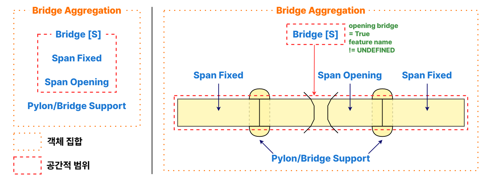
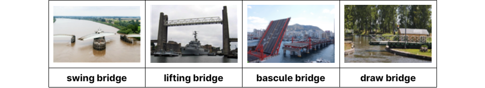

// tag::Bridge[]
===== Remark

* span:F[Bridge]는 항해 가능 여부와 관계없이 모든 수역 및 육지에서 입력이 가능함
* span:F[Bridge]은 상세 수준과 맥락에 따라 단독 객체로 입력하거나 교량 집합(span:R[Bridge aggregation])으로 구성할 수 있음

//
* 단독 교량 (span:F[Bridge][C,S])

** 단독 교량은 span:R[Bridge aggregation] 없이 span:F[Bridge](C,S)로, 이는 상세한 표현이 어렵거나 필요하지 않은 경우에 사용됨

* 사용 조건
** span:A[optimum display scale]에 해당하는 화면 축척에서 span:F[Span Fixed] 또는 span:F[Span Opening]과 같은 구성 객체로 교량을 상세히 표현하기 어려운 경우
** span:F[Pontoon] 또는 span:F[Dolphin]의 연결 교량인 경우
** 해안선 부근, 강, 하천 등 항해가 불가능한 지역인 경우

* 필수 속성
** span:A[feature name]: 교량의 이름을 입력
** span:A[opening bridge]: 개방 가능 여부를 나타내는 필수 속성으로, True 또는 False 값을 선택해야 함

//
* 교량 집합 (span:R[Bridge aggregation])

** span:R[Bridge aggregation]은 대표 객체 span:F[Bridge][C,S,N]를 사용하여 항해 가능한 수역에서 상세히 입력할 때 사용됨. 이는 구성 객체를 통해 교량의 구조를 자세히 표현할 수 있는 경우에 적용됨

* 사용 조건
** 항해 가능한 수역에서 구성 객체를 사용하여 교량을 상세히 입력할 수 있는 경우
** 교량 집합은 다음을 포함해야 함:
*** 대표 객체로 span:F[Bridge][C,S,N]
*** 최소한 하나의 span:F[Span Fixed] (고정 경간) 또는 span:F[Span Opening] (개방 경간)
*** 관련이 있는 경우, span:F[Pylon/Bridge Support] (교각) 또는 span:F[Pontoon] (부잔교)을 선택적으로 포함함
*** 고정 경간은 span:F[Span Fixed], 개방 경간은 span:F[Span Opening], 교각은 span:F[Pylon/Bridge Support]로 span:F[Bridge]와 구분하여 입력

* 필수 속성
** span:A[opening bridge]: 개방 가능 여부를 나타내는 속성으로, 항해 가능한 수역에 걸쳐져 있을 경우 `True` 또는 `False` 값을 선택해야 함
*** 집합에 span:F[Span Opening]이 포함된 경우, span:A[opening bridge] = (True)로 설정하고, span:A[category of opening bridge]를 필수로 입력해야 함
** 교량 이름:
*** 교량 이름이 알려져 있고 span:A[feature name]에 입력할 경우, span:F[Bridge][C,S]를 사용
*** 교량 이름이 알려지지 않았거나 입력할 필요가 없는 경우, span:F[Bridge][N]를 사용
** span:A[scale minimum]: span:R[Bridge aggregation]에 포함된 모든 객체는 동일한 span:A[scale minimum] 값을 가져야 함

* 공간적 범위:
*** span:F[Bridge][C,S]의 공간적 범위는 관련된 span:F[Span Fixed] 및 span:F[Span Opening] 의 전체 범위를 포함해야 함

.개방 교량의 교량 집합과 공간적 범위의 차이

//
include::common/information.adoc[]

.bridge construction의 예시

.category of opening bridge의 예시

===== Example

.고정 교량의 인코딩 예시
[cols="30,25,10,10,25", options="header"]
|===
|Attribute |Acronym |Type |Mult. |Value

|bridge construction|CATBRG|EN|0,1| 1 : arch
|bridge function|CATBRG|EN|0,*| 1 : vehicular 
|bridge function|CATBRG|EN|0,*| 3 : pedestrian
|condition|CONDTN|EN|0,1| 1 : Under Construction
|**feature name**||C|0,*| 
|    span:E[language]||(S)TE|1,1| eng
|    span:E[name]|OBJNAM/NOBJNM|(S)TE|1,1| Busan Bridge
|    name usage||(S)EN|0,1|1 : default name display
|**feature name**||C|0,*| 
|    span:E[language]||(S)TE|1,1|kor
|    span:E[name]|OBJNAM/NOBJNM|(S)TE|1,1| 부산대교
|    name usage||(S)EN|0,1|2 : alternate name display 
|opening bridge||(S)BO|0,1|false
|===

.개방 교량의 인코딩 예시
[cols="30,25,10,10,25", options="header"]
|===
|Attribute |Acronym |Type |Mult. |Value

|bridge construction|CATBRG|EN|0,1| 1 : arch
|bridge function|CATBRG|EN|0,*| 1 : vehicular 
|bridge function|CATBRG|EN|0,*| 3 : pedestrian
|category of opening bridge|CATBRG|EN|0,1| 5 : bascule bridge
|condition|CONDTN|EN|0,1| 1 : Under Construction
|**feature name**||C|0,*| 
|    span:E[language]||(S)TE|1,1| eng
|    span:E[name]|OBJNAM/NOBJNM|(S)TE|1,1| Yeongdo Bridge
|    name usage||(S)EN|0,1|1 : default name display
|**feature name**||C|0,*| 
|    span:E[language]||(S)TE|1,1|kor
|    span:E[name]|OBJNAM/NOBJNM|(S)TE|1,1| 영도대교
|    name usage||(S)EN|0,1|2 : alternate name display 
|opening bridge||(S)BO|0,1|true
|===

---
// end::Bridge[]
