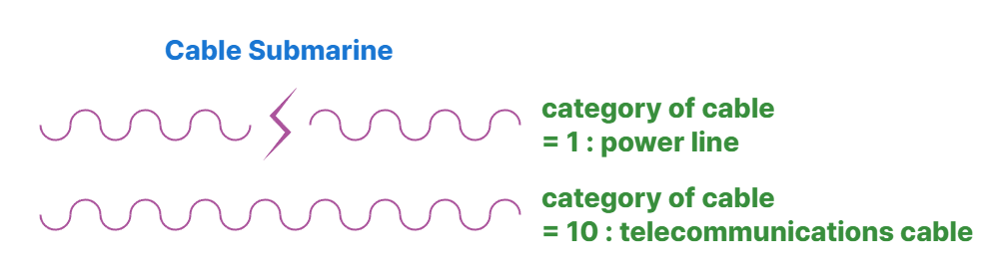

// tag::CableSubmarine[]
===== Remark

* span:F[Cable Submarine]은 정박이나 저인망 어업, 해저 활동에 종사하는 선박에 그 존재를 알리기 위해 입력해햐 함
* 사용 중인 span:F[Cable Submarine]은 수심 2000미터까지 입력해야하며 이는 선박이 케이블에 걸려 위험에 처할 수 있는 가장 깊은 수심임
* 케이블의 매설 깊이가 매설 구간에 따라 달라지는 경우, 여러 개의 객체로 나누어 span:A[buried depth]를 입력해야 함
* 전화선이나 광섬유 케이블과 같은 통신 케이블은 필요 시 span:A[category of cable] = 10 span:D[telecommunications cable]로 입력
* 사용하지 않는 케이블은 속성 span:A[status] = 4 span:D[not in use]로 입력하며, span:A[category of cable]은 입력하지 않음
* 고압 전력 케이블은 선박의 자기 나침반에 편차를 일으킬 수 있음. 이 경우 span:F[Local Magnetic Anomaly] 를 입력해야 함

===== Example

.Cable Submarine의 인코딩 예시
[cols="30,25,10,10,25", options="header"]
|===
|Attribute |Acronym |Type |Mult. |Value

|buried depth|BURDEP|RE|0,1| 5.0
|category of cable|CATCBL|EN|0,1| 1 span:D[power line]
|===

---
// end::CableSubmarine[]
