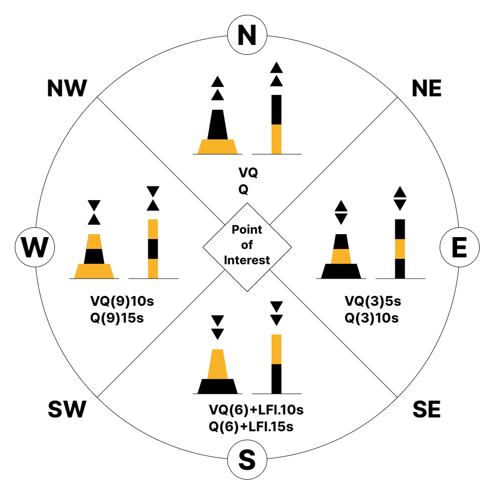

// tag::CardinalBeacon[]
===== Remark

* span:F[Cardinal Beacon]은 나침반과 함께 사용되어 항해자가 가장 안전한 항로를 찾을 수 있도록 안내하며, 입표가 표시된 지점에 대해 사분면에 따라 이름을 갖게됨.
* 항해자는 북방위표지의 북쪽, 동방위표지의 동쪽 등을 통과해야 함

//
IALA 해상 부표 시스템에 의거하여 ::
* 도색은 검정색과 노란색의 가로 줄무늬로 구성되며 방위에 따라 색의 패턴이 다름
* (장착된 경우) 두표는 검정색 이중 원뿔의 조합으로 구성되며 방위에 따라 모양이 다름
* (장착된 경우) 등화는 백색등으로 Q 또는 VQ 등광을 가지나, 북쪽은 연속 점멸, 동쪽은 3회 점멸, +
남쪽은 6회 점멸 + 긴 점멸(LFI), 서쪽은 9회 점멸(아날로그 시계와 유사) 함
* 위 조건에 따른 속성의 조합은 **반드시** <<CardinalBeacon_T1,[표 - Cardinal Beacon의 속성 조합 기준]>>를 참고하여 입력

//
include::common/phrase.adoc[tag=AtoN_Relationship]

//
* 항로표지 정보의 입력은 <<ListOfLights,링크>>를 참고

//
include::common/phrase.adoc[tag=Beacon_Attr_General]

//
include::common/phrase.adoc[tag=colourPattern]

//
include::common/phrase.adoc[tag=featureName_for_AtoN]

//
include::common/phrase.adoc[tag=information]

//
include::common/phrase.adoc[tag=IALA_Warning]

//
.Cardinal Beacon의 구성 (IALA A & B 동일)

[[CardinalBeacon_T1]]
.Cardinal Beacon의 속성 조합 기준
[cols="1,1,1,1,1", options="header"]
|===
| | North | East | South | West
5+^h|beacon
|span:E[beacon shape] 
|1 : stake, pole, perch, post +
/ 5 : pile beacon
|1 : stake, pole, perch, post +
/ 5 : pile beacon
|1 : stake, pole, perch, post +
/ 5 : pile beacon
|1 : stake, pole, perch, post +
/ 5 : pile beacon
|span:E[category of cardinal mark]
|1 : north cardinal mark 
|2 : east cardinal mark 
|3 : south cardinal mark 
|4 : west cardinal mark 
|span:E[colour] 
|2 : black +
 6 : yellow 
|2 : black +
 6 : yellow +
 2 : black 
|6 : yellow +
 2 : black
|6 : yellow +
 2 : black +
 6 : yellow
|colour pattern 
|1 : horizontal stripes 
|1 : horizontal stripes 
|1 : horizontal stripes 
|1 : horizontal stripes 
|marks navigational +
- system of
|2 : IALA B
|2 : IALA B
|2 : IALA B
|2 : IALA B
5+^h|topmark
|    colour
|2 : black
|2 : black
|2 : black
|2 : black
|    span:E[topmark/daymark shape]
|13 : 2 cones (points upward)
|11 : 2 cones (base to base)
|14 : 2 cones (points downward)
|10 : 2 cones (point to point)
5+^h|Light All Around : rhythm of light (if any)
|Rhythm Character
|V +
Q
| V(3)5s + 
Q(3)10s
| Q(6)+LFl.10s +
VQ(6)+LFl.15s
| Q(9)15s +
VQ(9)10s
|===

===== Example

.Cardinal Beacon, North의 인코딩 예시
[cols="30,25,10,10,25", options="header"]
|===
|Attribute |Acronym |Type |Mult. |Value

|span:E[beacon shape]|BCNSHP|EN|1,1| 5 : pile beacon
|span:E[category of cardinal mark]|CATCAM|EN|1,1| 1 : north cardinal mark
|span:E[colour]|COLOUR|EN|1,*| 2 : black
|span:E[colour]|COLOUR|EN|1,*| 6 : yellow
|colour pattern|COLPAT|EN|0,1| 1 : horizontal stripes
|**feature name**||C|0,*| 
|    span:E[language]||(S)TE|1,1| eng
|    span:E[name]|OBJNAM/NOBJNM|(S)TE|1,1|Haksanseo 
|    name usage||(S)EN|0,1|1 : default name display
|**feature name**||C|0,*| 
|    span:E[language]||(S)TE|1,1|kor 
|    span:E[name]|OBJNAM/NOBJNM|(S)TE|1,1|학산서
|    name usage||(S)EN|0,1|2 : alternate name display  
|marks navigational - system of|MARSYS|EN|0,1| 2 : IALA B
|nature of construction|NATCON|EN|0,*| 2 : concreted
|radar conspicuous|CONRAD|BO|0,1| false 
|**topmark**|TOPMAR|C|0,1| 
|    colour|COLOUR|(S)EN|0,*|2 : black 
|    span:E[topmark/daymark shape]|TOPSHP|(S)EN|1,1| 13 : 2 cones (points upward)
|vertical length|VERLEN|RE|0,1|19.8
|visual prominence|CONVIS|EN|0,1|1 : visually conspicuous
|===

.Cardinal Beacon, East의 인코딩 예시
[cols="30,25,10,10,25", options="header"]
|===
|Attribute |Acronym |Type |Mult. |Value

|span:E[beacon shape]|BCNSHP|EN|1,1| 5 : pile beacon
|span:E[category of cardinal mark]|CATCAM|EN|1,1| 2 : east cardinal mark
|span:E[colour]|COLOUR|EN|1,*| 2 : black
|span:E[colour]|COLOUR|EN|1,*| 6 : yellow
|span:E[colour]|COLOUR|EN|1,*| 2 : black
|colour pattern|COLPAT|EN|0,1| 1 : horizontal stripes
|**feature name**||C|0,*| 
|    span:E[language]||(S)TE|1,1| eng
|    span:E[name]|OBJNAM/NOBJNM|(S)TE|1,1|Kkamagyeo
|    name usage||(S)EN|0,1|1 : default name display
|**feature name**||C|0,*| 
|    span:E[language]||(S)TE|1,1| kor 
|    span:E[name]|OBJNAM/NOBJNM|(S)TE|1,1|까막여
|    name usage||(S)EN|0,1|2 : alternate name display 
|marks navigational - system of|MARSYS|EN|0,1| 2 : IALA B 
|nature of construction|NATCON|EN|0,*| 7 : metal
|radar conspicuous|CONRAD|BO|0,1| false 
|**topmark**|TOPMAR|C|0,1| 
|    colour|COLOUR|(S)EN|0,*|2 : black 
|    span:E[topmark/daymark shape]|TOPSHP|(S)EN|1,1| 11 : 2 cones (base to base)
|vertical length|VERLEN|RE|0,1|11
|visual prominence|CONVIS|EN|0,1|1 : visually conspicuous
|===

---
// end::CardinalBeacon[]
