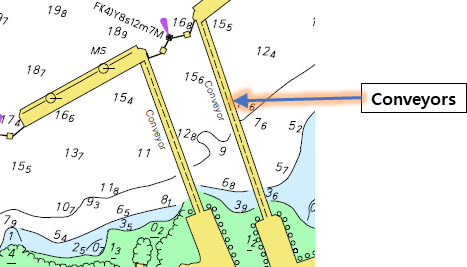

// tag::Conveyor[]
===== Remark

* 컨베이어 벨트, 케이블카는 span:F[Conveyor]로 입력
* 케이블카 입력 시 span:A[Category of conveyor] = (1 : aerial cableway)로 입력
* 가항수역에서 span:F[Conveyor]의 지지대는 span:F[Pylon/Bridge Support]로 span:A[Category of pylon] = (3 :aerial cableway pylon)를 입력
* span:A[vertical clearance fixed]는 10m 이상은 정수로 입력하고 10m 미만 일때만 소수점 첫째자리까지 입력한다. (예 : 9.5m)

.종이해도에서 Conveyor의 사용

===== Example

.Conveyor의 인코딩 예시
[cols="30,25,10,10,25", options="header"]
|===
|Attribute |Acronym |Type |Mult. |Value

|category of conveyor|CATCON|EN|0,1| 1 : aerial cableway
|**feature name**||C|0,*|
|    span:E[language]||(S)TE|1,1|eng
|    span:E[name]|OBJNAM/NOBJNM|(S)TE|1,1|Busan Air Cruise
|    name usage||(S)EN|0,1| 1 : default name display
|**feature name**||C|0,*|
|    span:E[language]||(S)TE|1,1|kor
|    span:E[name]|OBJNAM/NOBJNM|(S)TE|1,1|송도 해상 케이블카
|    name usage||(S)EN|0,1| 2 : alternate name display 
|**vertical clearance fixed**|VERCLR|C|0,1|
|    span:E[vertical clearance value]|VERCLR|(S)RE|1,1|33
|===

---
// end::Conveyor[]
