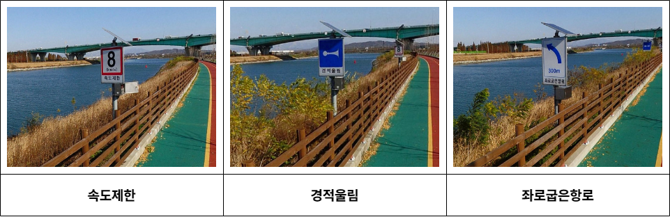

// tag::Daymark[]
===== Remark

* span:F[Daymark]의 설치 목적에 맞게 span:A[category of special purpose mark]를 입력
* span:A[elevation]은 육상 위에 있을 때만 입력
* 두표가 없거나 형상을 알 수 없으면 span:A[topmark/daymark shape] = (UNKNOWN)으로 입력
* span:A[topmark/daymark shape]에 해당하지 않는 형상은 span:A[shape information]을 사용하여 묘사해야 함

//
* 항로표지 정보의 입력은 <<ListOfLights,링크>>를 참고

//
.경인아라뱃길의 주간표지 예시

===== Example
.Daymark의 인코딩 예시
[cols="30,25,10,10,25", options="header"]
|===
|Attribute |Acronym |Type |Mult. |Value

|category of special purpose mark|CATSPM|EN|0,*| 25 span:D[speed limit mark]
|span:E[colour]|COLOUR|EN|1,*| 1 span:D[white]
|**feature name**||C|0,*|
|    span:E[language]||(S)TE|1,1| eng
|    span:E[name]|OBJNAM/NOBJNM|(S)TE|1,1| Speed Limit at Bend 8 knots
|    name usage||(S)EN|0,1| 1 span:D[default name display]
|**feature name**||C|0,*|
|    span:E[language]||(S)TE|1,1| kor
|    span:E[name]|OBJNAM/NOBJNM|(S)TE|1,1| 만곡부 속력제한 8 노트
|    name usage||(S)EN|0,1| 2 span:D[alternate name display]
|nature of construction|NATCON|EN|0,*| 7 span:D[metal]
|span:E[topmark/daymark shape]|TOPSHP|EN|1,1| 6 span:D[board]
|===

---
// end::Daymark[]
