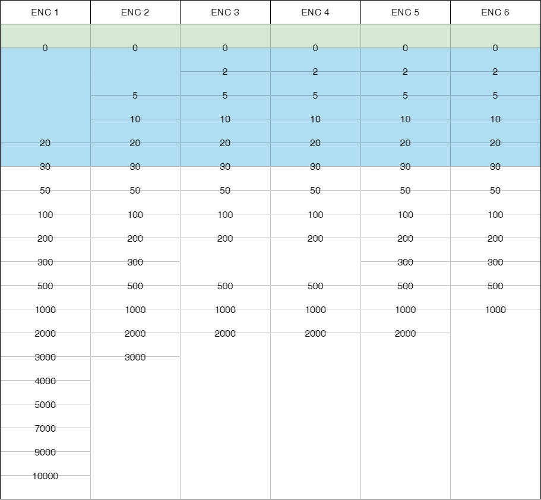

// tag::DepthContour[]
===== Remark

* span:A[value of depth contour]는 필수 입력(0, 2, 5, 10, 20, 30, 50, 100m 등....)

* 가능하면 span:F[Depth Contour]는 폐합되거나 데이터셋의 경계, span:F[Coastline], span:F[Shoreline Construction] 또는 다른 span:F[Depth Contour]에 연결하여 폐합된 영역을 형성해야 함 

* 대략적인 등심선은 span:F[Depth Contour]과 관련된 공간 품질을 입력하는 span:F[Spatial Quility]에 span:A[quality of horizontal measurement] = ( 4 : approximate) 로 입력할 수 있음
* 아래 <<Depth Contour_F1,[그림 - 밴드별 등심선 사용 현황]>>은 배포셀 기준으로 제작되었으며, 참고용으로만 사용해야 함.

//
[[Depth Contour_F1]]

.밴드별 등심선 사용 현황 - 참고용 (단위 : m)

					
===== Example
.Depth Contour의 인코딩 예시
[cols="30,25,10,10,25", options="header"]
|===
|Attribute |Acronym |Type |Mult. |Value

|interoperability identifier||URN|0,1|
|span:E[value of depth contour]|VALDCO|RE|1,1|30
|===

---
// end::DepthContour[]
