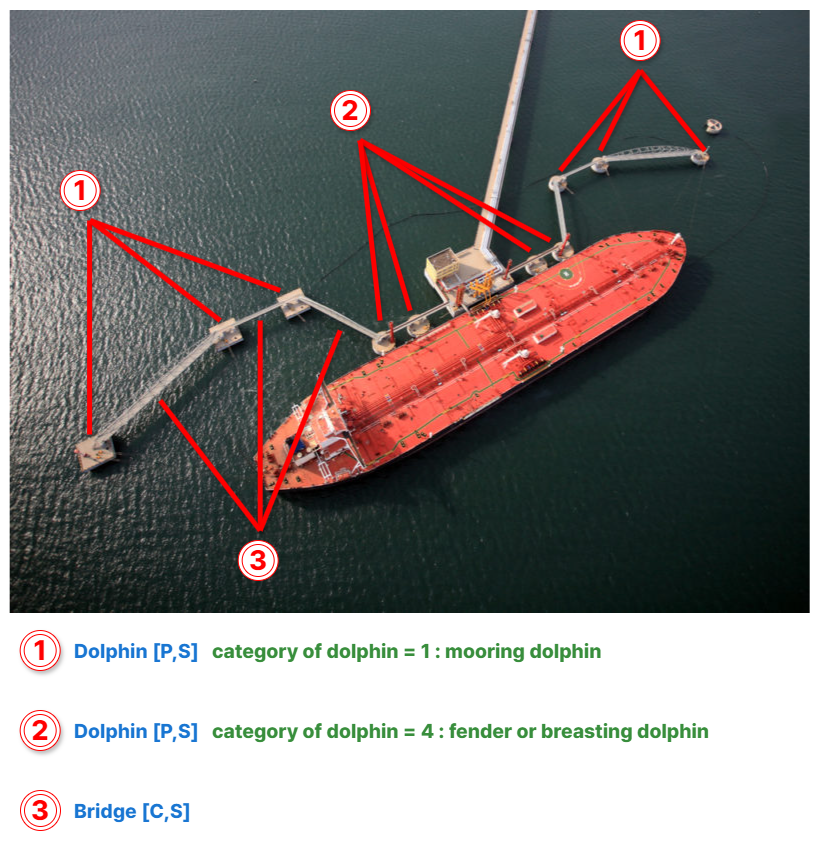

// tag::Dolphin[]
===== Remark

* 돌핀과 그 관련 구조물의 입력 방법은 아래 <<Dolphin_F1,[그림 - 돌핀 및 관련 구조물 입력 방법]>> 참고

[[Dolphin_F1]]

.돌핀 및 관련 구조물 입력 방법

//
* 사용하지 않는 계류/계선시설 또는 잔해는 span:F[Pile] 로 입력하며 span:A[category of pile] = 8 span:D[mooring post], span:A[condition] = 2 span:D[ruined]로 입력
* 사용하지 않는 계류/계선시설 또는 잔해가 항해에 위험할 땐 span:F[Obstruction]로 입력하며 span:A[category of obstruction] = 1 span:D[snag/stump]로 입력

===== Example
.Dolphin의 인코딩 예시
[cols="30,25,10,10,25", options="header"]
|===
|Attribute |Acronym |Type |Mult. |Value

|span:E[category of dolphin]||EN|1,*| 1 span:D[mooring dolphin]
|nature of construction|NATCON|EN|0,*| 2 span:D[concreted]
|===

---
// end::Dolphin[]
