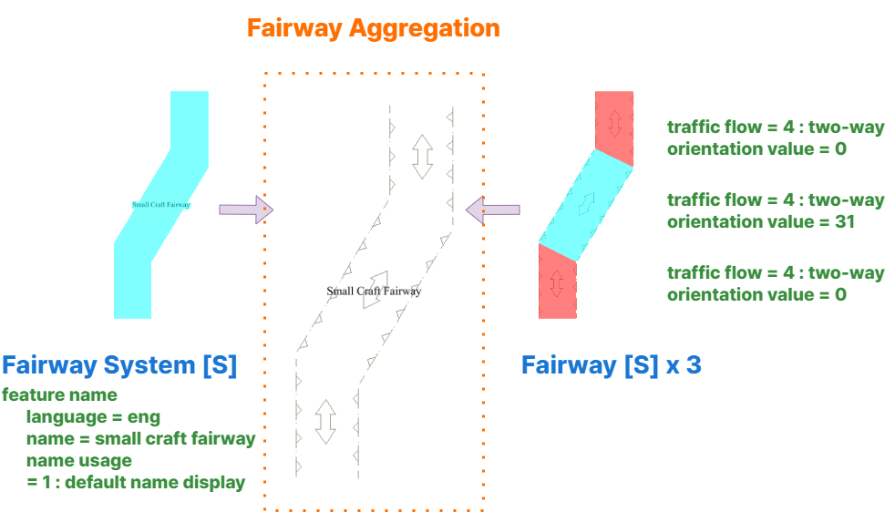

// tag::FairwaySystem[]
===== Remark

* 굽이진 경로로 구성된 항로는 대표 객체인 span:F[Fairway System]를 별도로 입력하고 이름은 span:A[feature name]으로 입력
** span:F[Fairway]의 공간적 범위는 구성 객체들의 전체 범위를 포함해야함
** 만약 항로가 단순해서 하나의 span:F[Fairway]로 전체 항로를 나타낼 수 있다면 해당 객체의 span:A[feature name] 에 입력

//
* 객체 관계
** span:R[Fairway Aggregation]을 정의하기 위해 구성 객체를 span:F[Fairway System]로 객체 관계를 맺어야함 (<<FAIRWAY_AGGR,※참고>>)
** span:R[Fairway Aggregation]는 span:F[Fairway System]와 함께 최소한 하나의 span:F[Fairway System]를 반드시 포함해야함
** span:R[Fairway Aggregation]의 구성 객체는 같은 span:A[scale minimum] 값을 가져야 함

include::common/information.adoc[]

===== Example
.Fairway System의 인코딩 예시
[cols="30,25,10,10,25", options="header"]
|===
|Attribute |Acronym |Type |Mult. |Value

|**feature name**||C|0,*|
|    span:E[language]||(S)TE|1,1| eng
|    span:E[name]|OBJNAM/NOBJNM|(S)TE|1,1| small craft fairway
|    name usage||(S)EN|0,1| 1 span:d[defalut name display]
|**feature name**||C|0,*|
|    span:E[language]||(S)TE|1,1| kor
|    span:E[name]|OBJNAM/NOBJNM|(S)TE|1,1| 소형선박 통항로
|    name usage||(S)EN|0,1| 2 span:d[alternate name display]
|===

---

// end::FairwaySystem[]
