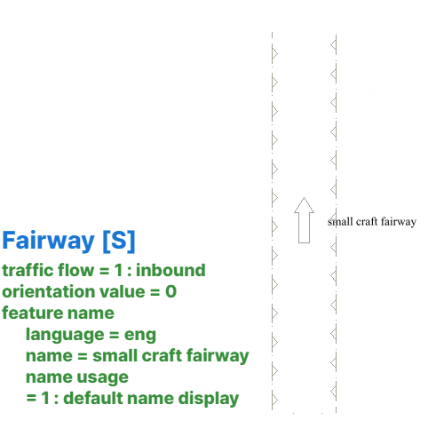

// tag::Fairway[]
===== Remark

* span:A[depth range minimum value]는 span:F[Fairway]에서 알려진 가장 얕은 깊이를 입력하는데 사용함
* 항로의 명칭을 표시할 때는 span:R[Fairway Aggregation] 관계의 span:F[Fairway System]의 span:A[feature name] 에 입력
* 만약 항로가 단순해서 span:F[Fairway] 하나로 전체 항로를 나타낼 수 있다면 해당 객체의 span:A[feature name] 에 입력, 이 때 span:A[maximum permitted draught]도 함께 입력할 수 있음 +
(즉 다른 span:F[Fairway]나 span:F[Fairway System]과 span:R[Fairway Aggregation]으로 연관되지 않는 경우를 뜻 함)

//
* span:F[Fairway] 구간을 정의하는 항로표지가 실제 span:F[Fairway] 경계에서 오프셋(offset)되어 있는 경우, 이는 항로표지의 span:A[information]을 사용하여 항해자에게 알려줘야 함
* span:F[Fairway] 구간을 정의하는 항로표지는 span:R[Fairway Auxiliary]을 통해 관계를 맺어야 함

* 필요하다면, 굽이진 경로로 구성된 항로는 각 구간을 별도로 분리하여 각각의 span:F[Fairway]에 대해 span:A[orientation value]를 입력해야 함
** 일방통행* 일때는 선박이 진행하는 방향으로 방위각을 입력하고, 양방향일때는 180 미만의 값을 입력해야 함
** 일방통행 : span:A[traffic flow] = 1 span:d[inbound] / 2 span:d[outbound] / 3 span:d[one-way]

//
include::common/information.adoc[]

===== Example
.Fairway의 인코딩 예시
[cols="30,25,10,10,25", options="header"]
|===
|Attribute |Acronym |Type |Mult. |Value

|depth range minimum value|DRVAL1|RE|0,1|
|**feature name**||C|0,*|
|    span:E[language]||(S)TE|1,1| eng
|    span:E[name]|OBJNAM/NOBJNM|(S)TE|1,1| small craft fairway
|    name usage||(S)EN|0,1| 1 span:d[defalut name display]
|**feature name**||C|0,*|
|    span:E[language]||(S)TE|1,1| kor
|    span:E[name]|OBJNAM/NOBJNM|(S)TE|1,1| 소형선박 통항로
|    name usage||(S)EN|0,1| 2 span:d[alternate name display]
|orientation value|ORIENT|RE|0,1| 70
|===

---
// end::Fairway[]
