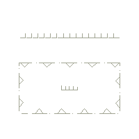
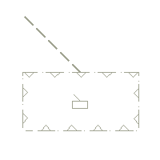

// tag::FishingFacility[]
===== Remark

* span:A[category of fishing facility]의 정의
**1 : fishing stake** :: 연안, 갯벌, 강 하구 등 조수간만의 차가 큰 지역에 설치되는 말뚝 또는 지주로, 어장을 구획하거나 물고기를 유도·포획하기 위해 사용, 국내의 ‘어책’이 DECG 정의에 부합하는 대표적 사례임
**2 : fish trap** :: 물고기를 포획하기 위해 설치되는 구조물로, DECG 원문에서는 **일반적으로 이동이 가능한 구조물(usually portable)**을 의미함 +
국내 사례로는 연안에 고정 설치된 그물 형태의 '정치망'이나 '닻자망' 등이 유사한 목적의 어획 방식으로 분류될 수 있음
**3 : fish weir** :: 앞의 어로 시설 보다 더 깊은 수역에 설치되는 경우가 많음. 이 시설은 규모가 커서 해안에서 수 마일까지 연장될 수 있으며, 항행에 장애를 초래할 수 있음
** span:A[category of fishing facility]에 입력한 값을 span:A[feature name] 또는 span:A[information]에 반복하여 기재해서는 안 됨

//
.category of fishing facility 값에 따른 S-101 묘화
[cols="20,^30", options="header", width=50%]
|===
| value | S-101 Portrayal
|1 : fishing stake
| 
|2 : fish trap +
3 : fish weir +
4 : tunny net +
| 
|===

//
* span:A[vertical length]는 해저로부터의 수직 높이를 입력하는 데 사용해야 함
** span:F[Fishing Facility]가 span:A[category of fishing facility] = (4 : tunny net) 일 경우 항행에 장애나 위험으로 간주되면, span:F[Obstruction]를 추가로 인코딩해야 함 
** 이는 ENC 이중 인코딩 원칙에 위배되지만, ECDIS에서 항행 위험을 명확히 표시하기 위해 권장됨
* 부유형 어류 집어 장치(FIoating fish aggregating devices; FAD)는 필요 시 span:F[Special Purpose/General Buoy]로 입력해야 함

===== Example
.Fishing Facility의 인코딩 예시
[cols="30,25,10,10,25", options="header"]
|===
|Attribute |Acronym |Type |Mult. |Value

|category of fishing facility|CATFIF|EN|0,1| 2 : fish trap
|**feature name**||C|0,*|
|    span:E[language]||(S)TE|1,1| eng
|    span:E[name]|OBJNAM/NOBJNM|(S)TE|1,1| set gill net
|    name usage||(S)EN|0,1| 1 : default name display
|**feature name**||C|0,*|
|    span:E[language]||(S)TE|1,1|
|    span:E[name]|OBJNAM/NOBJNM|(S)TE|1,1| 닻자망
|    name usage||(S)EN|0,1| 2 : alternate name display
|===

---
// end::FishingFacility[]
