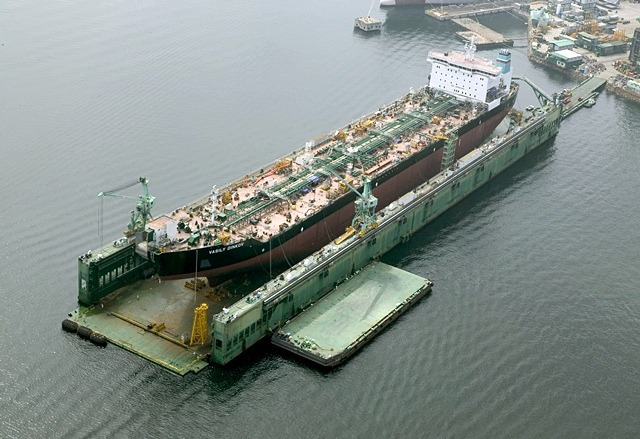

// tag::FloatingDock[]
===== Remark

* span:F[Floating Dock]는 반드시 span:F[Depth Area], span:F[Dredged Area], 또는 span:F[Unsurveyed Area]로 덮어야 함
* span:F[Floating Dock][S]의 경계를 별도의 객체(span:F[Coastline] 또는 span:F[Shoreline Construction])로 입력해서는 안 됨

//
.부유선거 (출처 : 삼성중공업 블로그)

// 
* 정보가 알려진 경우
** 항해가 가능한 부분의 길이와 너비는 span:A[horizontal clearance length]와 span:A[horizontal clearance width]로 입력
** 필요 시, span:F[Floating Dock] 자체의 최소 물리적 길이와 너비는 span:A[horizontal length]와 span:A[horizontal width]을 사용하여 입력
** span:A[depth range minimum value]는 span:F[Floating Dock]가 물에 잠겼을 때의 가장 얕은 깊이를 입력
** span:A[maximum permitted draught]는 도크에서 허용되는 최대 흘수를 입력

===== Example
.Floating Dock의 인코딩 예시
[cols="30,25,10,10,25", options="header"]
|===
|Attribute |Acronym |Type |Mult. |Value

|**feature name**||C|0,*
|    span:E[language]||(S)TE|1,1| eng
|    span:E[name]|OBJNAM/NOBJNM|(S)TE|1,1| Royal Dock No.1
|    name usage||(S)EN|0,1| 1 : 
|===
---
// end::FloatingDock[]
