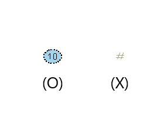
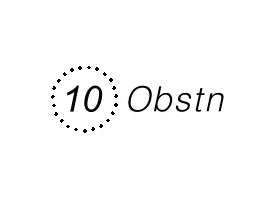
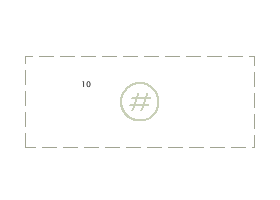
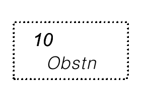

// tag::FoulGround[]
===== Remark

* span:F[Foul Ground]
** 항해는 안전하지만, 묘박, 해저 어업(예: 저인망, 트롤)을 피해야 하는 영역
** ECDIS 표시: "기타(other)" 디스플레이에 "항해는 안전하지만 묘박에 부적합한 해저 장애물 영역"으로 표시.
** 선원에게 진입/통과는 안전하지만, 수중 활동은 위험함을 알림.
* span:F[Obstruction] 및 span:A[category of obstruction] = 6 (foul area)
** 항해에 위험한 미탐사 장애물이 다수 존재하는 영역.
** ECDIS 표시: "기본 디스플레이(base display)"에 "항해 장애물"로 표시, 진입/통과 시 경보 발생
** 선박의 항해 자체가 안전하지 않음을 알림.
* 불확실한 경우 span:F[Obstruction]으로 인코딩 권장.

//
* span:F[Foul Ground]가 span:A[status] = 9 span:D[value reported (not confirmed)] 일 때 span:A[reported date]은 필수
* span:F[Foul Ground][S]는 Skin of the Earth 객체 span:F[Depth Area], span:F[Dredged Area] 또는 span:F[Unsurveyed Area]로 덮여 있어야 함
* 해저면 수준으로 절단된 플랫폼은 span:F[Foul Ground]로 입력하고, 해저면에서 돌출되어 절단된 플랫폼은 span:F[Foul Ground]로 입력
* 흩어진 침선의 잔해는 span:F[Wreck]으로 입력해야하며, span:F[Foul Ground]로 입력하지 않음

//
* 국내 지침: 5m 보다 깊은 수심(즉, 수심 5m 초과)에서 span:F[Obstruction][S]은 항해 가능 영역으로 간주되어 span:F[Foul Ground]로 입력

.국내 지침 : 지오메트리 유형별 입력 예시
[cols="25,25,70", options="header"]
|===
3+^h| Point
| ENC
| Paper Chart
| Encoding
| 
| 
| span:F[Obstruction] +
span:A[category of obstruction] = 6 span:D[foul area] +
span:A[quality of vertical measurement] = 6 span:D[least depth known] +
span:A[value of sounding] = (10) +
span:A[water level effect] = 3 span:D[always under water/submerged] +
* span:F[Foul Ground]로 입력하면 전자해도에서 장애물 수심 표시되지 않고 '#'로 표시되므로 span:F[Obstruction]으로 입력
3+^h| Surface
| ENC
| Paper Chart
| Encoding
| 
| 
| span:F[foul ground] +
span:A[value of sounding] = (10) +
span:A[quality of vertical measurement] = 6 span:D[least depth known] +
span:A[water level effect] = 3 span:D[always under water/submerged]
|===

//
include::common/phrase.adoc[tag=information]

===== Example
.Foul Ground의 인코딩 예시
[cols="30,25,10,10,25", options="header"]
|===
|Attribute |Acronym |Type |Mult. |Value

|quality of vertical measurement|QUASOU|EN|0,*| 6 span:D[least depth known]
|value of sounding|VALSOU|RE|0,1 | 10
|===

---
// end::FoulGround[]
