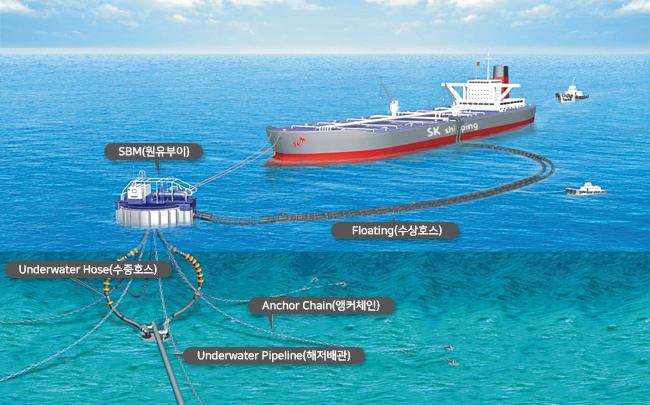

// tag::InstallationBuoy[]
===== Remark

* 주로 유조선 및 가스선의 하역을 위한 계선 부표로 사용됨
* 시설장치 부표는 span:F[Installation Buoy]로 입력해야 함

//
.Installation Buoy의 설명도 (출처 : SK 이노베이션)

//
include::common/phrase.adoc[tag=AtoN_Relationship]

//
include::common/phrase.adoc[tag=Buoy_Attr_General]

//
include::common/phrase.adoc[tag=colourPattern]

//
include::common/phrase.adoc[tag=featureName_for_AtoN]

//
include::common/phrase.adoc[tag=information]

//
include::common/phrase.adoc[tag=IALA_Warning]

===== Example
.Installation Buoy의 인코딩 예시
[cols="30,25,10,10,25", options="header"]
|===
|Attribute |Acronym |Type |Mult. |Value

|span:E[buoy shape]|BOYSHP|EN|1,1| 7 : superbuoy
|category of installation buoy|CATINB|EN|0,1| 2 : single buoy mooring
|span:E[colour]|COLOUR|EN|1,*| 6 : yellow
|**feature name**||C|0,*| 
|    span:E[language]||(S)TE|1,1| eng
|    span:E[name]|OBJNAM/NOBJNM|(S)TE|1,1| Ulsan Hang No.B
|    name usage||(S)EN|0,1| 1 : default name display
|**feature name**||C|0,*|
|    span:E[language]||(S)TE|1,1| kor
|    span:E[name]|OBJNAM/NOBJNM|(S)TE|1,1| 울산항 SK B호 계선
|    name usage||(S)EN|0,1| 2 : alternate name display
|product|PRODCT|EN|0,*| 1 : oil
|===

---
// end::InstallationBuoy[]
