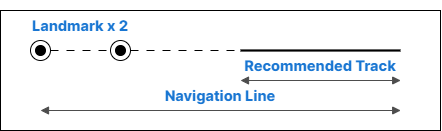
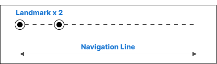
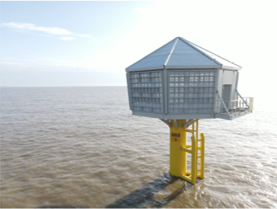

// tag::Landmark[]
===== Remark

* 높이와 지형적 기복에 따라, 항해목표물로 간주되는 건축물 또는 구조물은 내륙으로 수 km까지 입력해야함
* 대축척 해도 일수록 span:F[Landmark]를 정확하고 개별적으로 입력해야 함
** 일반적으로 건물, 특히 도시 및 기타 건축 지역을 표현할 때, 제작자의 목표는 건축 지역의 범위와 건물의 밀도를 올바르게 전달하는 인상을 주는 것이어야 함

//
* span:F[Landmark]에 span:A[category of landmark], span:A[function]의 입력이 필요한 경우 <<Landmark_Structure_Encoding_Combinations,건축물 및 구조물의 입력 방법>> 을 참고

//
* span:F[Landmark]에 span:A[height], span:A[elevation], span:A[vertical length]의 입력이 필요한 경우 <<Height_Elevation_VerticalLength,높이의 구분>> 을 참고

//
* 폐허가 된 span:F[Landmark]는 양호한 상태의 객체와 동일하게 입력하고, 속성 span:A[condition] = (2 :ruined)를 입력해야 함
//
include::common/phrase.adoc[tag=featureName_for_AtoN]

//
include::common/phrase.adoc[tag=AtoN_Relationship]

//
* 라디오 및 텔레비전 마스트와 타워는 멀리서도 보일 가능성이 높으므로, 내륙 깊숙이 위치하더라도 span:F[Landmark]로 입력해야함. 이들은 대개 span:F[Light Air Obstruction]을 갖추고 있음

//
* 선원이 span:F[Landmark]를 식별하는 데 도움을 주기 위해, 구조물 상단의 지상 높이, span:A[vertical length]를 추가하는 것이 유용할 수 있음

//
* span:A[special purpose mark] 는 span:F[Landmark]가 지도선(leading line), 피험선(clearing line)의 전방 또는 후방 표지로 사용되는 경우에만 사용해야 하며, 각각 span:A[special purpose mark] = (16 : leading mark 또는 41 : clearing mark)로 입력해야 함

.지도선(leading line)과 피험선(clearing line)의 구분
[cols="1,1" options="header"]
|===
|Leading Line |Clearing Line
|
|
| span:F[Landmark] +
span:A[special purpose mark] = (16 : leading mark)
| span:F[Landmark] +
span:A[special purpose mark] = (41 : clearing mark)
| span:F[Navigation Line] +
span:A[category of navigation line] = (3 : leading line bearing a recommended track)
| span:F[Navigation Line] +
span:A[category of navigation line] = (1 : clearing line)
| span:F[Recommended Track] +
span:A[based on fixed marks] = (True) + 
| -
|===

//
* span:A[category of landmark]의 값 중에서 (26 :bridge) 및 (27 :dam)은 span:F[Landmark][P]인 경우에만 사용해야 하며, 항해 가능한 수역 위에는 입력하지 않아야 함.

//
* 항해 가능한 수역에 위치한 span:F[Landmark]의 경우, span:A[in the water] = (True)로 입력해야 함. 
* 아래 그림과 같은 "새 둥지 형태"의 구조물이 수역에 위치한 경우, 지지 구조물(예: span:F[Pile])을 인코딩할 필요는 없음

.새 둥지 형태의 구조물(Bird Nesting structure) 예시

//
* 건축물이나 구조물을 면(surface) 형태로 입력하고 그 일부인 타워나 첨탑과 같은 두드러진 형상을 인코딩해야 하는 경우, 두 개의 객체를 생성해야 함
** 주요 건물에 대한 span:F[Building][S]
** 두드러진 형상에 대한 span:F[Landmark][P]

//
* 모든 span:F[Landmark]가 시각적으로 두드러지는 것은 아니지만, 시각적으로 두드러지는 경우 (즉, 바다에서 뚜렷하고 눈에 띄게 보이는 경우), span:A[visual prominence]을 입력해야 함

//
===== Example
[cols="30,25,10,10,25", options="header"]
|===
|Attribute |Acronym |Type |Mult. |Value

|span:E[category of landmark]|CATLMK|EN|1,*| 17 : tower
|colour|COLOUR|EN|0,*| 1 : white
|**feature name**||C|0,*|
|    span:E[language]||(S)TE|1,1| eng
|    span:E[name]|OBJNAM/NOBJNM|(S)TE|1,1| Homigot
|    name usage||(S)EN|0,1| 1 : default name display
|**feature name**||C|0,*|
|    span:E[language]||(S)TE|1,1| kor
|    span:E[name]|OBJNAM/NOBJNM|(S)TE|1,1| 호미곶
|    name usage||(S)EN|0,1| 2 : alternate name display
|function|FUNCTN|EN|0,*| 33 : light support
|nature of construction|NATCON|EN|0,*| 1 : masonry
|vertical length|VERLEN|RE|0,1| 26
|span:E[visual prominence]|CONVIS|EN|1,1| 1 : visually conspicuous
|===

---

// end::Landmark[]
