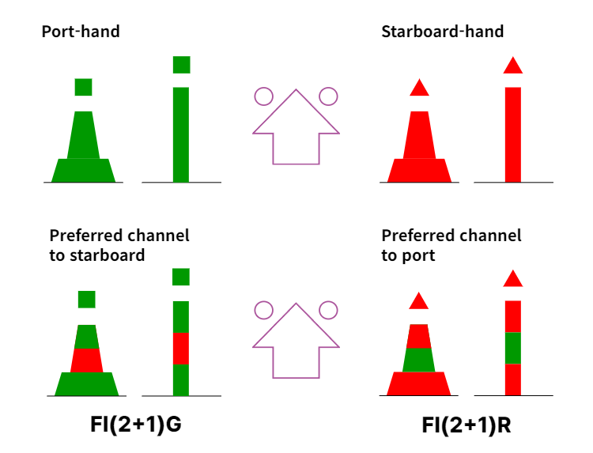

// tag::LateralBeacon[]
===== Remark

* span:F[Lateral Beacon]은 표지의 방향이 잘 정의된 항로에서 사용됨
* 이는 따라야할 항로의 좌현(Port)과 우현(Starboard)을 나타냄

//
IALA 해상 부표 시스템에 의거하여 ::
* 좌현 표지
** 도색은 IALA A 지역에서는 빨간색, IALA B 지역에서는 초록색임
** 두표는 캔 모양(■)임
* 우현 표지
** 도색은 IALA A 지역에서는 초록색, IALA B 지역에서는 빨간색임
** 두표는 원추형(△)임
* 우항로 우선표지
** 도색은 IALA A 지역에서는 빨간색 바탕에 초록색 가로 줄무늬, IALA B 지역에서는 초록색 바탕에 빨간색 가로 줄무늬 임
** 두표는 캔 모양(■)임
** (장착된 경우) 등화는 Fl(2+1)G 임
* 좌항로 우선표지
** 도색은 IALA A 지역에서는 초록색 바탕에 빨간색 가로 줄무늬, IALA B 지역에서는 빨간색 바탕에 초록색 가로 줄무늬 임
** 두표는 원추형(△) 임
** (장착된 경우) 등화는 Fl(2+1)R 임
* 위 조건에 따른 속성의 조합은 **반드시** <<LateralBeacon_T1,[표 - Lateral Beacon의 속성 조합 기준]>>를 참고하여 입력

//
include::common/phrase.adoc[tag=AtoN_Relationship]

//
* 등대표 보는법은 <<ListOfLights,링크>>를 참고

//
include::common/phrase.adoc[tag=Beacon_Attr_General]

//
include::common/phrase.adoc[tag=colourPattern]

//
include::common/phrase.adoc[tag=featureName_for_AtoN]

//
include::common/phrase.adoc[tag=information]

//
include::common/phrase.adoc[tag=IALA_Warning]

//
.Lateral Beacon의 구성 (IALA B 지역)

[[LateralBeacon_T1]]
.Lateral Beacon의 속성 조합 기준 (IALA B 지역)
[cols="1,1,1,1,1", options="header"]
|===
| |좌현(port) |우현(starboard) |우항로 우선(preffered channel to starboard) |좌항로 우선(preffered channel to port)
5+^h|beacon
|span:E[beacon shape] 
|1 : stake, pole, perch, post +
/ 5 : pile beacon
|1 : stake, pole, perch, post +
/ 5 : pile beacon
|1 : stake, pole, perch, post +
/ 5 : pile beacon
|1 : stake, pole, perch, post +
/ 5 : pile beacon
|span:E[category of lateral mark]
|1 : port-hand lateral mark
|2 : starboard-hand lateral mark
|3 : preferred channel to starboard lateral mark
|4 : preferred channel to port lateral mark
|span:E[colour] 
|4 : green
|3 : red
|4 : green +
 3 : red + 
 4 : green
|3 : red + 
 4 : green +
 3 : red
|colour pattern 
|
|
|1 : horizontal stripes 
|1 : horizontal stripes 
|marks navigational +
- system of
|2 : IALA B
|2 : IALA B
|2 : IALA B
|2 : IALA B
5+^h|topmark
|    colour
|4 : green
|3 : red
|4 : green
|3 : red
|    span:E[topmark/daymark shape]
|5 : cylinder
|1 : cone (point up)
|5 : cylinder
|1 : cone (point up)
5+^h|Light All Around : rhythm of light (if any)
|Rhythm Character
| ~ G
| ~ R
| Fl(2+1)G
| Fl(2+1)R
|===

===== Example
.좌현표지의 인코딩 예시
[cols="30,25,10,10,25", options="header"]
|===
|Attribute |Acronym |Type |Mult. |Value

|span:E[beacon shape]|BCNSHP|EN|1,1| 5 : pile beacon
|span:E[category of lateral mark]|CATLAM|EN|1,1| 1 : port-hand lateral mark
|span:E[colour]|COLOUR|EN|1,*| 4 : green 
|**feature name**||C|0,*|
|    span:E[language]||(S)TE|1,1| eng
|    span:E[name]|OBJNAM/NOBJNM|(S)TE|1,1| Dadaepoeo No 1
|    name usage||(S)EN|0,1| 1 : default name display
|**feature name**||C|0,*|
|    span:E[language]||(S)TE|1,1| kor
|    span:E[name]|OBJNAM/NOBJNM|(S)TE|1,1| 다대포 1호
|    name usage||(S)EN|0,1| 2 : alternate name display
|marks navigational - system of|MARSYS|EN|0,1| 2 : IALA B
|nature of construction|NATCON|EN|0,*| 7 : metal
|**topmark**|TOPMAR|C|0,1|
|    colour|COLOUR|(S)EN|0,*| 4 : green  
|    span:E[topmark/daymark shape]|TOPSHP|(S)EN|1,1| 5 : cylinder
|vertical length|VERLEN|RE|0,1| 7.4
|visual prominence|CONVIS|EN|0,1|1 : visually conspicuous
|===

.좌항로 우선표지의 인코딩 예시
[cols="30,25,10,10,25", options="header"]
|===
|Attribute |Acronym |Type |Mult. |Value

|span:E[beacon shape]|BCNSHP|EN|1,1| 5 : pile beacon
|span:E[category of lateral mark]|CATLAM|EN|1,1| 4 : preferred channel to port lateral mark
|span:E[colour]|COLOUR|EN|1,*| 3 : red
|span:E[colour]|COLOUR|EN|1,*| 4 : green
|span:E[colour]|COLOUR|EN|1,*| 3 : red
|colour pattern|COLPAT|EN|0,1| 1 : horizontal stripes 
|**feature name**||C|0,*|
|    span:E[language]||(S)TE|1,1| eng
|    span:E[name]|OBJNAM/NOBJNM|(S)TE|1,1| Nakdonggang
|    name usage||(S)EN|0,1| 1 : default name display
|**feature name**||C|0,*|
|    span:E[language]||(S)TE|1,1| kor
|    span:E[name]|OBJNAM/NOBJNM|(S)TE|1,1| 낙동강 명지 을숙도 분기점
|    name usage||(S)EN|0,1| 2 : alternate name display
|marks navigational - system of|MARSYS|EN|0,1| 2 : IALA B
|nature of construction|NATCON|EN|0,*| 7 : metal
|**topmark**|TOPMAR|C|0,1|
|    colour|COLOUR|(S)EN|0,*| 3 : red
|    span:E[topmark/daymark shape]|TOPSHP|(S)EN|1,1| 1 : cone (point up)
|vertical length|VERLEN|RE|0,1| 7
|visual prominence|CONVIS|EN|0,1|1 : visually conspicuous
|===

---
// end::LateralBeacon[]
