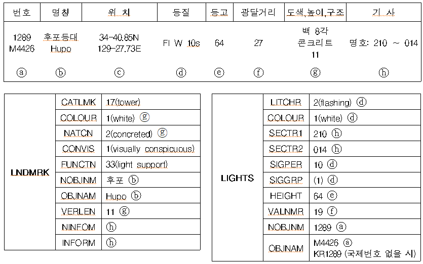

// tag::LightAllAround[]

.일반 기준

- 등화의 분류에 따라 `Light Fog Detector` (안개탐지등), `Light Air Obstruction` (항공장애등), `Light Sectored` (분호등화), `Light All Around` (일반등화) 피처로 구분하여 입력
- `Light All Around` 피처 중 주요등대*는 속성 [Major light] = true로 설정 +
   * 주요등대는 관할기관이 지정한 “광달거리 15M 이상”의 “백색” 등화
- 등화와 함께 사용되는 구조물의 명칭은 구조물로 사용되는 피처의 [Feature Name]에 입력 +  
   (교량등의 경우 `Light All Around` 의 [Feature name]에 입력)
- 등화는 단독으로 사용될 수 없으며, 함께 사용되는 구조물과 {Structure/Equipment} 관계 설정 +
   ※ Relation 페이지 참조
- [Feature name]에는 항로표지의 관리번호(등대표번호) 입력
- 관리번호(등대표번호)입력 시, 국내번호는 관리번호 앞에 KR, 국제번호는 M을 덧붙임(KR3259.2, M4187.45)
- S-57에서 [DATEND]가 속성정보로 입력되어 날짜가 지난 경우 속성 삭제 추천 +
  ([DATEND]는 객체가 존재하는 마지막 날짜를 표기하는 것으로 이후에는 삭제됨을 의미함)
- 각 속성입력에 있어 정보가 충분하지 않을 경우 Multiplicity는 (unknown)으로 입력가능

.입력예시
[cols="1,1", options="header"]
|===
|Attribute |Value
|Category of Light| 4: leading light
|Colour| 4: green
|Height| 12m

2+h|**Rhythm of Light** 
|    Light Characteristic|2:flashing
|    Signal Group| (1)
|    Signal Period| 4
|Light Visibility|2: low intensity 

2+h|**Feature Name**
|    Name Usage| 1: default name
|    Language| eng
|    Name| Haedogyo C

2+h|**Feature Name**
|    Name Usage| 2: alternate name
|    Language| kor
|    Name| 해도교 교량 중앙등

2+h|**Feature Name**
|    Name Usage| 1: default name
|    Language| eng
|    Name| M4337.2

2+h|**FeatureName**
|    Name Usage| 2: alternate name
|    Language| kor
|    Name| 2161.5

|Major Light| true
|Status| 7: temporary
|Value of Nominal Range| 15
|===
// end::LightAllAround[]