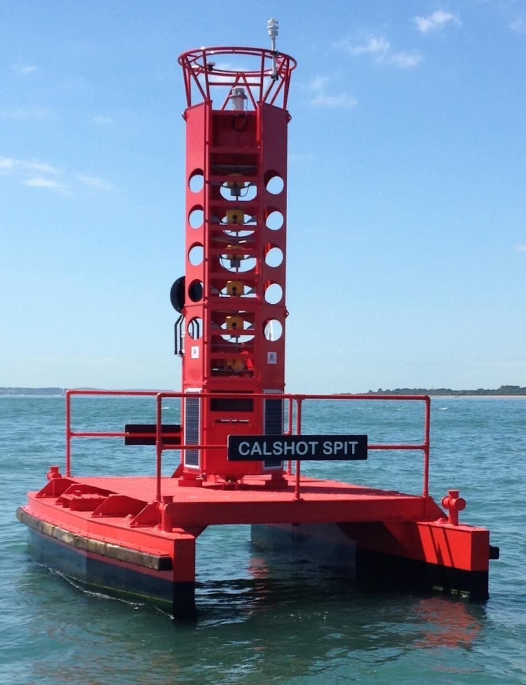

// tag::LightFloat[]
===== Remark

* 해양자료수집시스템(Ocean Data Acquisition System,ODAS)부표 는 **반드시** span:F[Special Purpose/General Buoy]로 입력되어야 하며 해저 또는 부유체에 의해 수중에 위치한 ODAS는 span:F[Obstruction]으로 입력되어야 함

//
.Light Float

//
include::common/phrase.adoc[tag=AtoN_Relationship]

//
* 항로표지 정보의 입력은 <<ListOfLights,링크>>를 참고

//
include::common/phrase.adoc[tag=colourPattern]

//
include::common/phrase.adoc[tag=featureName_for_AtoN]

//
include::common/phrase.adoc[tag=information]

===== Example
.Light Float의 인코딩 예시
[cols="30,25,10,10,25", options="header"]
|===
|Attribute |Acronym |Type |Mult. |Value

|span:E[colour]|COLOUR|EN|1,*| 6 : yellow
|**feature name**||C|0,*|
|    span:E[language]||(S)TE|1,1| eng
|    span:E[name]|OBJNAM/NOBJNM|(S)TE|1,1| Seogwipo
|    name usage||(S)EN|0,1| 1 : default name display
|**feature name**||C|0,*|
|    span:E[language]||(S)TE|1,1| kor
|    span:E[name]|OBJNAM/NOBJNM|(S)TE|1,1| 서귀포 남방기상
|    name usage||(S)EN|0,1| 2 : alternate name display
|===

---
// end::LightFloat[]
