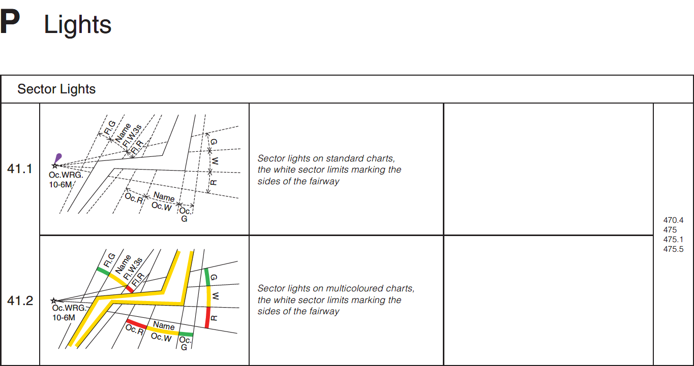
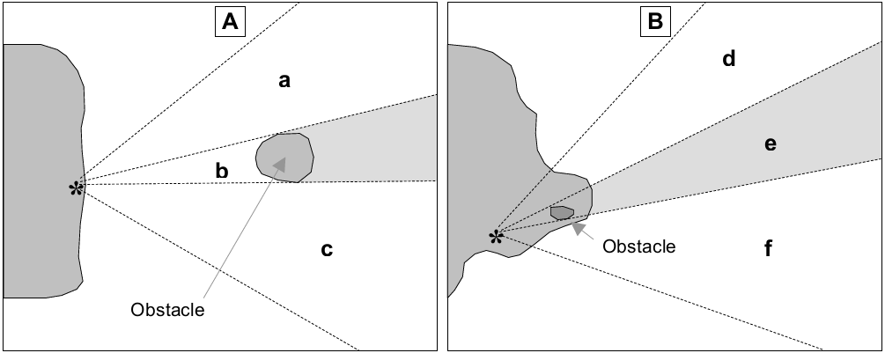

// tag::LightSectored[]
===== Remark

* 분호나 중시선(Leading line)으로 특정 방위를 갖는 등화는 span:F[Light Sectored]로 입력해야 함
** 분호는 빛(등화의 광선)이 바다방향에서 보이는 **명호**와 보이지 않는 **암호**로 구분함
** 단일 또는 다중 분호(Sector)가 있는 등화, 장애물에 의한 분호가 있는 등화, 도등, 중시선 상의 등화, 지향등, 물결무늬 등화는 모두 해당됨
* 국내 종이해도는 방향성이 있는 등화를 제외하고 일반적으로 **암호**를 사용하고 있지만, 전자해도는 기본적으로 **명호**를 사용하여 입력해야 하므로
span:A[sector limit]의 하위 속성 span:A[sector limit one] 및 span:A[sector limit two]를 반대로 입력하지 않도록 주의해야 함.
** 그럼에도 불구하고, **암호**를 입력해야 하는 필요가 있는 경우 <<obscured,암호를 가진 등화>>를 참고

//
* span:A[sector characteristics]의 하위속성 span:A[light sector]는 일반적으로 등화가 표시되는 분호(명호)의 각 부분을 채우는데 사용됨
* 명호마다 등질이 다른 경우 (예: 복합 등화), span:A[sector characteristics]를 별도로 입력해야 함

* span:A[sector limit]의 하위 속성 span:A[sector limit one] = (0) 및 span:A[sector limit two] = (360) 으로 입력하지 않아야 함. 
** 즉, span:F[Light All Around]를 span:F[Light Sectored]로 입력해서는 안됨.

//
* span:F[Light Sectored]가 지향등이면 span:A[light sector]의 하위 속성 span:A[directional character]을 사용하여 입력해야 함. 
* 강도가 다른 분호가 있는 등화의 경우 span:A[light sector] 하위 속성 span:A[light visibility] = 4 span:D[intensified]를 채워야 함
* 지향등은 span:A[orientation]의 입력은 필수이며, span:A[sector limit]의 입력은 선택적임

//
* span:A[sector line length]는 ECDIS에서 분호를 표시하도록 설정한 경우, 중요한 분호가 표시되는 범위을 확장하는 데 사용할 수 있음
** ENC 데이터셋의 의도된 용도를 고려하여 span:A[sector line length]의 사용을 결정해야 하며, 분호의 표시가 활성화된 경우 화면의 혼잡을 피해야 함
** 또한 전체 ENC 데이터셋에서 분호의 일관된 표시를 고려해야함 
** span:A[sector line length]를 입력하는 경우, 해당 등화의 span:A[value of nominal range]에 입력한 값을 초과하지 않아야 함

//
* 두 개의 span:F[Light Sectored]에서 명호가 교차되는 영역은 정의된 영역은 항해에 있어 고립적이거나 때로는 중대한 위험의 존재를 나타내는 데 사용됨
** 이러한 위험의 정확한 위치는 알려지지 않을 수 있으며 ECDIS에서 명호가 표시될 때, 일반적인 명호의 반경으로는 항해자에게 위험의 특성이 명확히 전달되지 않을 수 있음. 이는 섹터 범위가 위험 구역을 명확히 형성하지 않거나 위험 요소를 충분히 포함하지 않을 수 있기 때문임.
* 명호의 교차 영역(위험 구역)을 더 명확히 표시하기 위해, 해도제작 기술자는 span:A[sector line length]을 적절히 활용하는 방안을 고려해야 함. 
** 위험 가능 영역의 정의가 중요하다고 판단될 경우, 교차 영역을 포함하는 span:F[Caution Area]를 입력하여 이를 수행해야 함. ** 명호의 교차 영역(위험 구역)의 요약 정보는 span:F[Caution Area]의 span:A[information]을 사용하여 입력해야 함

//
* 일련의 span:F[Light Sectored]의 백색 명호로 정의된 연속적인 항로 영역은 span:F[Fairway]를 통해 입력할 수 있음

.명호로 정의된 항로의 예시 (S-4 B-475.5)

//
:ObjectName: span:F[Light Air Obstruction]을
:Relation: span:R[Structure/Equipment]
:linkTo: Structure_Equipment
include::common/phrase.adoc[tag=Refer]

//
* 주요 등화는 속성 span:A[major light] = (true)로 입력
** 주요 등화(Major lights): 육지 발견(landfall), 외해의 위험, 선박 항로와 항만접근로 표시 또는 해양환경의 보호 목적의 항해적으로 중요한 등대 span:D[출처: S-4 B470.2, IALA recommendation O-130 Edition 2 ‘Navigational significance – Category I’]
** span:A[major light] = (true)로 등화가 "주요" 등화임을 나타내는 것은 ECDIS에서 등화가 표시되는 방식에 영향을 미치며, 등화의 법적 또는 공식적 중요도 분류에 기반하지 않음
** 일반적으로 주요 등화는 바다에서 사용되며, 통상 15해리 이상의 범위를 가지거나 항구 외곽 접근로에 사용되는 등화로 간주됨.
** 국내 기준 : 광달거리 **15해리 이상**의 **백색** 등화를 **주요 등화**로 지정하고 있음

//
* 등화의 이름은 매우 중요하며, 등화의 이름이 등화가 위치한 명명된 객체(예: 등대, 부표)와 명백히 동일한 경우, 등화의 이름을 반복 입력할 필요는 없음

include::common/phrase.adoc[tag=featureName_for_AtoN]

//
* 등화 방식(조명 기술)의 세부 사항(예: 네온)을 입력해야 하는 경우, span:A[information]을 사용해야 함

* span:A[light charateristic] = 11 span:D[spotlight]을 입력하는 경우, 그 목적은 span:A[information]로 입력해야 함

* span:A[vertical datum]은 span:A[height]에만 적용되며, 이 값은 span:F[Vertical Datum of Data]에 입력된 span:A[vertical datum] 값과 다를 경우에만 입력해야 함

* span:A[vertical datum] = 13 span:D[low water]은 내륙 수로에만 적용되며, 조석이 적용되는 수역에서 등화 높이의 기준 데이터를 나타내기 위해 사용해서는 안 됨

//
* 등화에 관한 일반적인 사항은 <<Lights_General,링크>>를 참고

//
* 항로표지 정보의 입력은 <<ListOfLights,링크>>를 참고

//
[[obscured]]
.암호를 가진 등화 (S-4 B-475.3)

* 명호가 항해가 가능한 영역의 일부에서 해상 장애물 너머로 가려져 있는 경우(위 그림 (A) 참조), span:F[Light Sectored]를 사용하여 입력해야 함. 
** 명호 (a) - (c)는 각각 span:A[light sector]를 사용하여 입력해야 함.
** 부분적으로 가려진 분호(암호) (b)는 span:A[light sector]의 하위 속성 span:A[light visibility] = 8 span:D[partially obscured]와 span:A[value of nominal range]를 등화에서 장애물까지의 거리로 설정하여 입력해야 함. 
* 등화와 장애물 사이에 항해 가능한 수역이 없는 경우(위 그림 19-2 (B)의 (e) 참조), 가려진 부분은 **암호**가 아니므로 별도의 span:A[light sector]로 입력하지 않아야 함. 
** 단, 명호의 항해 가능 부분에서 희미한 등화가 보이는 경우에는 span:A[light sector]를 사용하고, 하위 속성 span:A[light visibility] = 3 span:D[faint]로 입력해야 함. 
** 해상에서 등화가 보이는 명호 (d)와 (f)는 각각의 span:A[sector characteristics]로 입력해야 함.

//
.지향등 (S-4 B-475.3)
* 지향등(Directional Lights)은 항해자가 따라야 할 방향을 표시하는 매우 좁은 명호를 공통적으로 가짐. 좁은 명호는 다음에 의해 둘러싸일 수 있음
** 불이 켜지지 않은 분호 또는 강화되지 않는 등화
** 다른 색상 또는 등질을 가진 명호. 일부 지향등은 매우 정밀하여 명호 경계에서 색상이 완전히 바뀌는 각도가 1분(0.02도) 미만임. +
이는 3.5km 거리에서 관찰할 때 측면 거리가 1미터에 해당함. +
또한, 빛(등화의 광선)의 가장자리까지 강도가 유지되며, 관찰자가 중심축에서 멀어지더라도 빛의 강도가 감소하지 않음.

//
* span:A[orientation]은 지향등의 지도선(leading line)을 해상에서 보는 방향으로 나타낼 때만 입력해야 함. 
** 이는 span:F[Recommended Track] 또는 span:F[Navigation Line]이 지향등과 연관되지 않은 경우에 해당함. 
** 지향등의 명호가 span:F[Recommended Track] 또는 span:F[Navigation Line]과 연관된 경우, 명호의 span:A[orientation]은 빈(null) 값으로 채워야 함.

//
===== Example
.일반적인 분호등의 인코딩 예시
[cols="30,25,10,10,25", options="header"]
|===
5+^h| Fl(2)15s68m22M
h|Attribute h|Acronym h|Type h|Mult. h|Value

|height|HEIGHT|RE|0,1| 68
|**span:E[sector characteristics]**||C|1,*|
|    span:E[light characteristic]|LITCHR|(S)EN|1,1| 2 span:D[flashing]
|**    span:E[light sector]**||(S)C|1,*|
|        span:E[colour]|COLOUR|(S)EN|1,*| 1 span:D[white]
|**        sector limit**||(S)C|0,1|
|**            span:E[sector limit one]**|SECTR1|(S)C|1,1|
|                span:E[sector bearing]|SECTR1/SECTR2|(S)RE|1,1| 198
|**            span:E[sector limit two]**|SECTR2|(S)C|1,1|
|                span:E[sector bearing]|SECTR1/SECTR2|(S)RE|1,1| 70
|        value of nominal range|VALNMR|(S)RE|0,1| 22
|    signal group|SIGGRP|(S)TE|0,*| (2)
|    signal period|SIGPER|(S)RE|0,1| 15
|===

.다색 분호등의 인코딩 예시
[cols="30,25,10,10,25", options="header"]
|===
5+^h| Iso.WRG12s66m21-17M
h|Attribute h|Acronym h|Type h|Mult. h|Value

|height|HEIGHT|RE|0,1| 66
|**span:E[sector characteristics]**||C|1,*|
|    span:E[light characteristic]|LITCHR|(S)EN|1,1| 7 span:D[isophased]
|**    span:E[light sector]**||(S)C|1,*|
|        span:E[colour]|COLOUR|(S)EN|1,*| 1 span:D[white]
|**        sector limit**||(S)C|0,1|
|**            span:E[sector limit one]**|SECTR1|(S)C|1,1|
|                span:E[sector bearing]|SECTR1/SECTR2|(S)RE|1,1| 306
|**            span:E[sector limit two]**|SECTR2|(S)C|1,1|
|                span:E[sector bearing]|SECTR1/SECTR2|(S)RE|1,1| 342
|        value of nominal range|VALNMR|(S)RE|0,1| 21
|**    span:E[light sector]**||(S)C|1,*|
|        span:E[colour]|COLOUR|(S)EN|1,*| 3 span:D[red]
|**        sector limit**||(S)C|0,1|
|**            span:E[sector limit one]**|SECTR1|(S)C|1,1|
|                span:E[sector bearing]|SECTR1/SECTR2|(S)RE|1,1| 234
|**            span:E[sector limit two]**|SECTR2|(S)C|1,1|
|                span:E[sector bearing]|SECTR1/SECTR2|(S)RE|1,1| 306
|        value of nominal range|VALNMR|(S)RE|0,1| 17
|**    span:E[light sector]**||(S)C|1,*|
|        span:E[colour]|COLOUR|(S)EN|1,*| 4 span:D[green]
|**        sector limit**||(S)C|0,1|
|**            span:E[sector limit one]**|SECTR1|(S)C|1,1|
|                span:E[sector bearing]|SECTR1/SECTR2|(S)RE|1,1| 342
|**            span:E[sector limit two]**|SECTR2|(S)C|1,1|
|                span:E[sector bearing]|SECTR1/SECTR2|(S)RE|1,1| 46
|        value of nominal range|VALNMR|(S)RE|0,1| 17
|    signal group|SIGGRP|(S)TE|0,*| (1)
|    signal period|SIGPER|(S)RE|0,1| 12
|===

.지향등의 인코딩 예시
[cols="30,25,10,10,25", options="header"]
|===
5+^h| Fl(2)8s76m27M, 299˚
h|Attribute h|Acronym h|Type h|Mult. h|Value

|height|HEIGHT|RE|0,1| 76
|**span:E[sector characteristics]**||C|1,*|
|    span:E[light characteristic]|LITCHR|(S)EN|1,1| 2 span:D[flashing]
|**    span:E[light sector]**||(S)C|1,*|
|        span:E[colour]|COLOUR|(S)EN|1,*| 1 span:D[white]
|**        directional character**||(S)C|0,1|
|**            span:E[orientation]**||(S)C|1,1|
|                span:E[orientation value]|ORIENT|(S)RE|1,1| 299
|**        sector limit**||(S)C|0,1|
|**            span:E[sector limit one]**|SECTR1|(S)C|1,1|
|                span:E[sector bearing]|SECTR1/SECTR2|(S)RE|1,1| 297
|**            span:E[sector limit two]**|SECTR2|(S)C|1,1|
|                span:E[sector bearing]|SECTR1/SECTR2|(S)RE|1,1| 301
|        value of nominal range|VALNMR|(S)RE|0,1| 27
|    signal group|SIGGRP|(S)TE|0,*| (2)
|    signal period|SIGPER|(S)RE|0,1| 8
|===

---
// end::LightSectored[]
