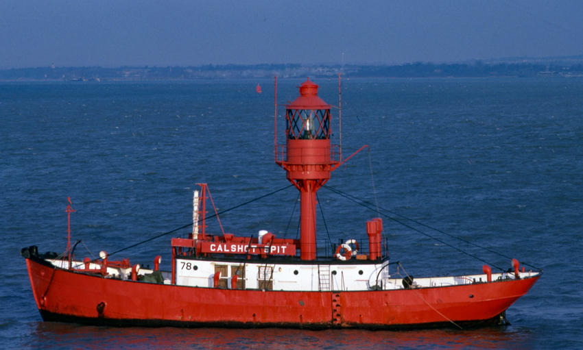

// tag::LightVessel[]
===== Remark

* span:F[Light Vessel]은 일반적으로 광달거리가 10해리 이상으로 **주요 부유 등화(Major floating lights)**로 분류됨. 
** 예외적으로, 고립된 위치와 같은 특별한 상황에서는 더 낮은 범위의 부유 등화도 **주요 부유 등화(Major floating lights)**로 지정될 수 있음. 

//
.Light Vessel

//
include::common/phrase.adoc[tag=AtoN_Relationship]

//
* 항로표지 정보의 입력은 <<ListOfLights,링크>>를 참고

//
include::common/phrase.adoc[tag=colourPattern]

//
include::common/phrase.adoc[tag=featureName_for_AtoN]

//
include::common/phrase.adoc[tag=information]

===== Example
.Light Vessel의 인코딩 예시
[cols="30,25,10,10,25", options="header"]
|===
|Attribute |Acronym |Type |Mult. |Value

|span:E[colour]|COLOUR|EN|1,*| 3 span:d[red]
|visual prominence|CONVIS|EN|0,1| 1 span:d[visual prominence]
|===

---
// end::LightVessel[]
