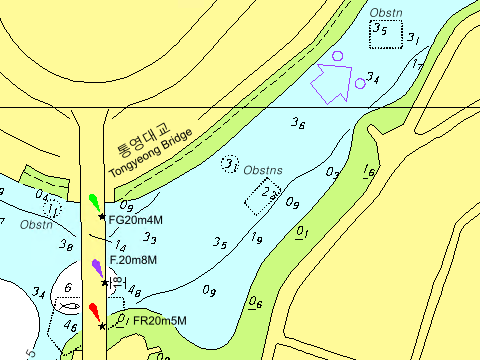

// tag::LocalDirectionOfBuoyage[]
===== Remark

* 데이터셋 내에서 표지의 유도방향이 일부 지역에서만 해당하는 규칙에 의해 정의되어 지정되어야 하는 영역이 존재할 수 있음. 
* 필요한 경우, 이러한 영역은 span:F[Local Direction of Buoyage]로 입력해야 하며, 필수 속성 span:A[orientation value]를 통해 표지의 유도방향을 나타내야 함. 
* span:F[Local Direction of Buoyage]은 서로 겹쳐서는 안되며, span:F[Navigational System of Marks] 위에 입력되어야 함
* ECDIS 표시를 위해 span:A[marks navigational — system of]는 필수이며, 이는 아래에 깔린 span:F[Navigational System of Marks]에 입력된 span:A[marks navigational — system of] 값과 동일하게 채워야 함.

.종이해도의 Local Direction of Buoyage

* span:E[주의] 종이해도에서는 점(Point) 형태지만 전자해도에서는 면(Suface) 형태이기 때문에 지오메트리 입력 방식에 대해서는 데이터셋마다 별도의 협의가 필요함

//
include::common/phrase.adoc[tag=information]

===== Example
.Local Direction of Buoyage의 인코딩 예시
[cols="30,25,10,10,25", options="header"]
|===
|Attribute |Acronym |Type |Mult. |Value

|span:E[marks navigational - system of]|MARSYS|EN|1,1| 2 : IALA B
|span:E[orientation value]|ORIENT|RE|1,1| 40
|===

---

// end::LocalDirectionOfBuoyage[]
