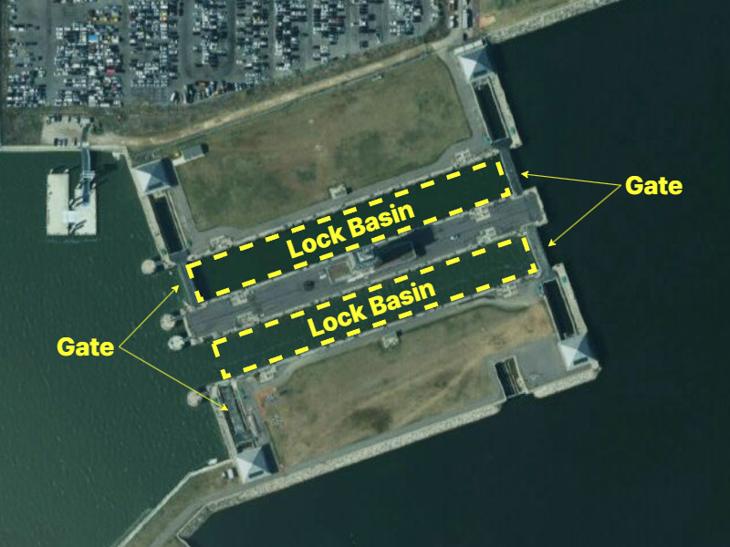

// tag::LockBasin[]
===== Remark

* 편집 축척에서 갑문이 항행 가능한 경우, span:F[Depth Area] 또는 span:F[Dredged Area]로 입력해야 함
* 갑문의 경계는 span:F[Coastline], span:F[Shoreline Construction] 또는 span:F[Gate]와 같은 적절한 객체로 입력해야 함
* 이 경우 갑문은 span:F[Lock Basin]으로 입력하지 않아야 하며, 갑문의 이름을 입력 하는 경우, span:F[Sea Area/Named Water Area]를 사용해야 함.

* 편집 축척에서 갑문이 항행 불가능한 경우, span:F[Lock Basin]을 사용하며, span:F[Land Area] 또는 span:F[Unsurveyed Area] 위에 입력되어야 함. 
* 보다 더 소축척에서는 갑문을 span:F[Lock Basin] 없이 span:F[Gate]로 입력할 수 있음

.아라서해갑문 (출처 : 브이월드)

* 갑문의 이름은 span:F[Lock Basin]의 span:A[feature name]을 사용하여 입력해야 함
* 갑문의 출입문은 span:F[Gate]로 입력해야 하며, 속성 span:A[category of gate] = 4 span:D[lock gate]또는 3 span:D[caisson]로 입력해야 함

//
include::common/phrase.adoc[tag=information]

===== Example
.Lock Basin의 인코딩 예시
[cols="30,25,10,10,25", options="header"]
|===
|Attribute |Acronym |Type |Mult. |Value

|**feature name**||C|0,*|
|    span:E[language]||(S)TE|1,1| eng
|    span:E[name]|OBJNAM/NOBJNM|(S)TE|1,1 | Ara Seohae Gate
|    name usage||(S)EN|0,1| 1 span:D[default name display]
|**feature name**||C|0,*|
|    span:E[language]||(S)TE|1,1| kor
|    span:E[name]|OBJNAM/NOBJNM|(S)TE|1,1 | 아라서해갑문
|    name usage||(S)EN|0,1| 2 span:D[alternate name display]
|horizontal length|HORLEN|RE|0,1| 210
|horizontal width|HORWID|RE|0,1| 28.5
|===

---
// end::LockBasin[]
