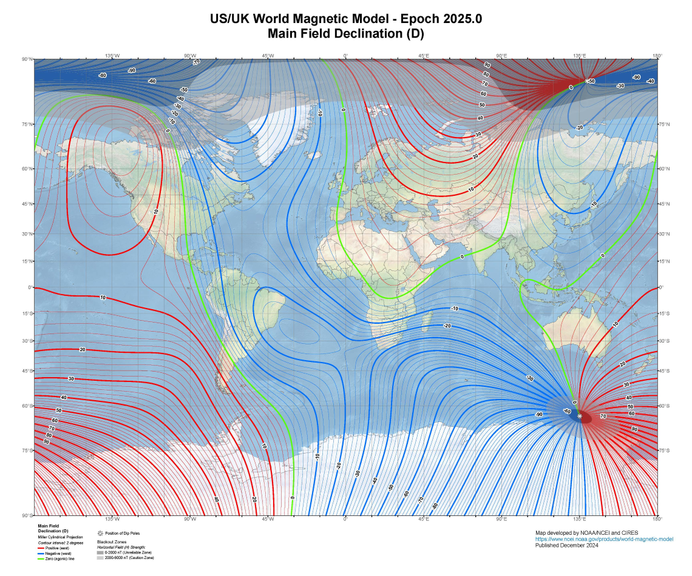
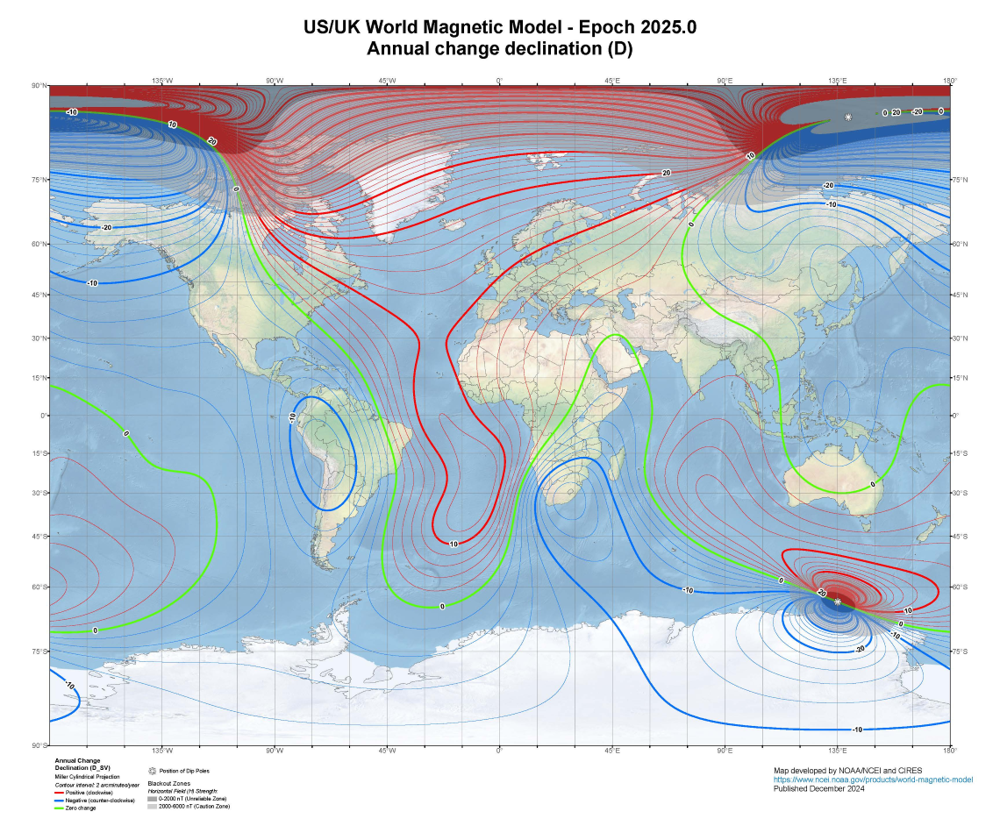

// tag::MagneticVariation[]
===== Remark

* 다양한 자기 데이터 중에서 자기 편차는 항해자에게 가장 중요한 요소임
* span:F[Magnetic Variation]는 최소한 5년마다 갱신해야 함
* ECDIS 사용자가 자기 편차 정보를 쉽게 접근할 수 있도록, 이 정보를 span:F[Magnetic Variation][S]으로 입력하는 것이 권장됨
** 면[Surface] 형태로 입력하면 사용자가 ECDIS의 Pick Report 기능을 통해 해도 내 임의의 위치에서 자기 편차 값을 확인할 수 
있음

//
* span:A[reference year]는 연도 값만 채워야 함
* 자기 모델(World Magnetic Model,WMM)은 일반적으로 link:https://www.ncei.noaa.gov/products/world-magnetic-model[NOAA]에서 5년마다 업데이트 함
** 예: 2025, 2030... 주기(epoch)

.자기 편차도
[cols="^a,^a"]

|===
| 
| 
|===
* 자기 편차도는 현재 주기(epoch)의 전 세계 자기 편차 값을 등자선(isogonals)으로 보여줌. 
** 데이터셋에 입력할 경우, 선(Curve) 형태의 두 자료를 면(Surface)로 가공하여 입력해야 함
** 변화율 곡선은 이런 해도에 겹쳐 표시되어, 현재 주기 내 임의의 시점에서 특정 위치의 값을 추정할 수 있음.

//
* 고위도(극지방)에서의 자기 편차 정보는 변동성이 크고 신뢰도가 낮아 항해에 일반적으로 사용되지 않음. 따라서 극지 수역을 다루는 ENC에는 자기 편차 정보를 포함할 필요가 없음.

===== Example
.Magnetic Variation의 인코딩 예시
[cols="30,25,10,10,25",options="header"]
|===
|Attribute |Acronym |Type |Mult. |Value

|span:E[reference year for magnetic variation]|RYRMGV|TD|1,1| 2025----
|span:E[value of annual change in magnetic variation]|VALACM|RE|1,1| -2.0
|span:E[value of magnetic variation]|VALMAG|RE|1,1| -9.00
|**information**|INFORM|C|0,*|
|    span:E[language]||(S)TE|1,1| eng
|    text|INFORM/NINFOM|(S)TE|0,1| World Magnetic Model for 2025(20250101)
|===

---
// end::MagneticVariation[]
