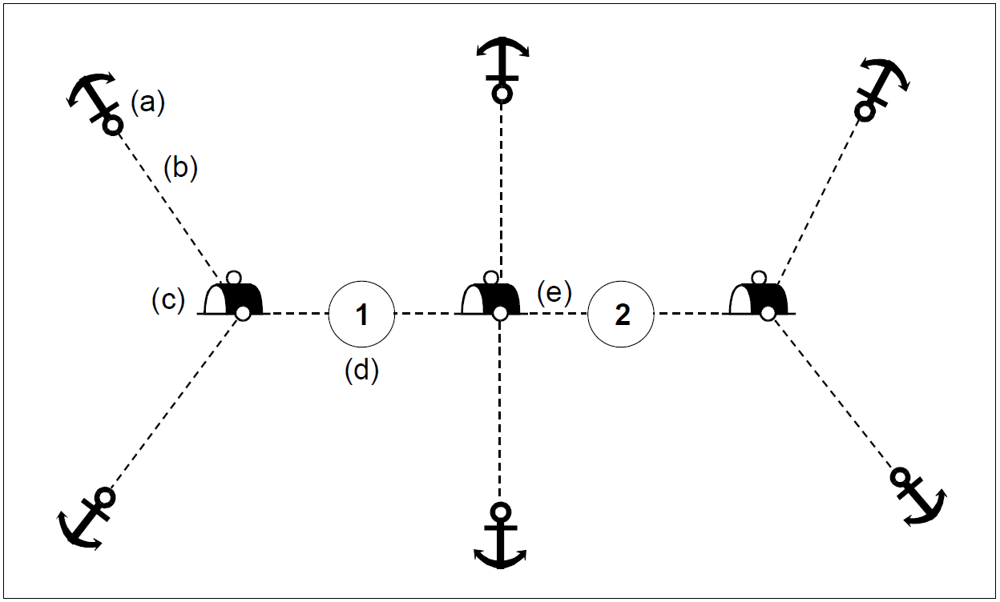

// tag::MooringTrot[]
===== Remark

* 완전한 span:F[Mooring Trot]은 지면 장치(ground tackle), 계류 케이블(mooring cables), 부표(buoys), 및 접속 케이블(junction cables)상의 계류 정박지(mooring berths)로 구성됨

.Mooring Trot의 구성

    (a) 지면 장치(ground tackle) : span:F[Obstruction]을 사용하며, span:A[category of obstruction] = (9 : ground tackle)로 입력해야 함

    (b) 계류 케이블(mooring cables) : span:F[Cable Submarine]을 사용하며, span:A[category of cable] = (6 :mooring cable)로 입력해야 함

    (c) 부표(buoys) : span:F[Mooring Buoy]을 사용해 입력해야 함

    (d) 계류 정박지(mooring berths) : span:F[Berth]을 사용해 입력해야 함

    (e) 접속 케이블(junction cables) : span:F[Cable Submarine]을 사용하며, span:A[category of cable] = (9 : junction cable)로 입력해야 함

//
* 객체 관계
** span:R[Mooring Trot Aggregation]을 정의하기 위해 구성 객체를 span:F[Mooring Trot]으로 객체 관계를 맺어야함 (<<TROT_AGGR,※참고>>)
** span:R[Mooring Trot Aggregation]는 span:F[Mooring Trot]과 함께 최소한 하나의 구성 객체를 반드시 포함해야함
** span:R[Mooring Trot Aggregation]의 구성 객체는 같은 span:A[scale minimum] 값을 가져야 함

//
* 계류 트롯의 명칭을 입력해야 하는 경우 span:F[Mooring Trot][S]로 입력하고 span:A[feature name]을 사용해 입력해야 함. 공간적 범위는 계류 트롯의 모든 구성 요소를 포함해야 함.
* 이름이 없는 계류 트롯을 입력해야 하는 경우, span:F[Mooring Trot][N]으로 입력해야 함
* span:F[Mooring Trot] 내 개별 선석의 이름 또는 번호는 관련 span:F[Berth]의 span:A[feature name]을 사용해 반드시 입력해야 함.

//
include::common/phrase.adoc[tag=NotUsedFeature]

---
// end::MooringTrot[]
