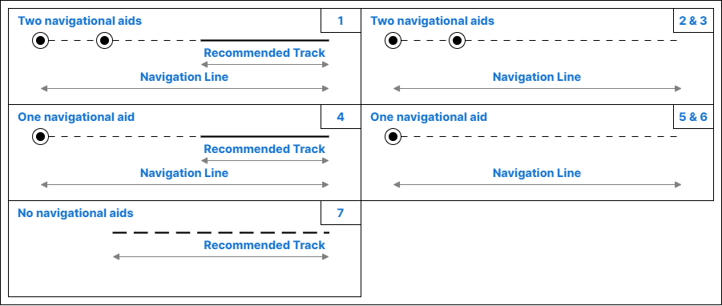

// tag::NavigationLine[]
===== Remark

* 피험선(Clearing Lines)은 부표로 보호되지 않은 위험물이 있는 암석 지역에서 중요하며, 요트와 같은 범선(직선 항로를 항상 유지할 수 없는 경우) 및 기타 소형 선박이 연안 가까이에서 항해할 때 사용됨. 
* 고립된 위험을 표시하는 중시선(transits)은 해안에 세워진 입표 또는 기타 표지로 구성되며, 고립된 위험의 위치를 대략적으로(입표 쌍이 두 개가 아닌 경우) 나타냄. 
* 입표 또는 등화에 기반한 지도선(leading lines)은 편집 축척에서 표현 할 수 있는 경우 입력해야 함. 
* 자연 지형에 기반한 지도선은 다른 항로표지가 불충분해 보일 때, 최대 축척 해도에서 입력해야 함.

//
* span:F[Navigation Line]과 span:F[Recommended Track]의 사용은 아래 표와 그림에 더 자세히 정의됨.

[cols="a,a,a,a,a"]
|===
5+^| 

|Figure
|Type 
|span:F[Navigation Line] + 
span:A[category of navigation line] 
|span:F[Recommended Track] + 
span:A[based on fixed marks] 
|Navigational Aids

|1
|지도선 상의 추천항로 +
(Recommended track on a leading line)
|3 span:d[leading line bearing a recommended track]
|True 
|at least 2

|2
|일직선으로 놓인 표지상의 피험선 +
(Clearing line on marks in line)
|1 span:d[clearing line]
|-
|at least 2

|3
|일직선으로 놓인 표지상의 중시선 +
(Transit line on marks in line)
|2 span:d[transit line]
|-
|at least 2

|4
|방위선상의 추천항로 +
(Recommended track on a bearing)
|3 span:d[leading line bearing a recommended track]
|True
|1

|5
|방위선상의 피험선 +
(Clearing line on a bearing)
|1 span:d[clearing line]
|-
|1

|6
|방위선상의 중시선 +
(Transit line on a bearing)
|2 span:d[transit line]
|-
|1

|7
|고정물표에 기반하지 않은 추천항로 +
(Recommended track not based on fixed marks)
|-
|False
|-
|===

//
* span:A[orientation value]의 값은 해상에서 바라본 방위 값으로 반드시 입력해야 함
* span:F[Navigation Line]의 범위는 항해 보조 장치의 가시성에 따라 결정됨.
* span:F[Recommended Track]은 선박이 항해에 사용해야 하는 span:F[Navigation Line]의 일부임.

//
===== Example
.Navigation Line의 인코딩 예시
[cols="30,25,10,10,25", options="header"]
|===
|Attribute |Acronym |Type |Mult. |Value

|span:E[category of navigation line]|CATNAV|EN|1,1| 3 span:d[leading line bearing a recommended track]
|**span:E[orientation]**||C|1,1| 
|    span:E[orientation value]|ORIENT|(S)RE|1,1| 270
|===

---
// end::NavigationLine[]
