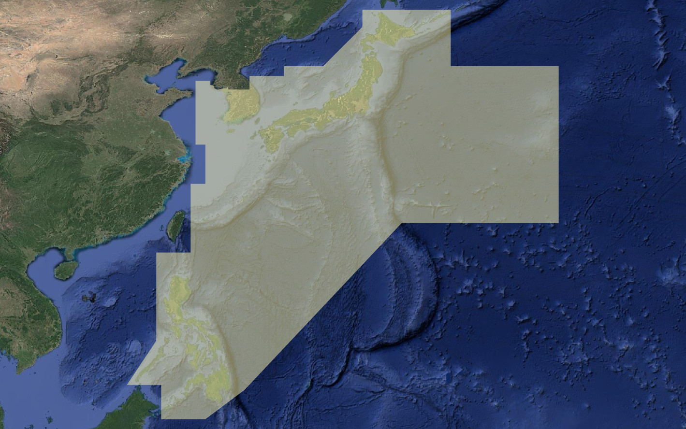

// tag::NavigationalSystemOfMarks[]
===== Remark

* 데이터가 포함된 데이터셋의 모든 부분은 반드시 span:F[Navigational System of Marks] 로 덮여야 하며, +
  span:A[marks navigational — system of]를 통해 영역에 적용된 해상부표식을 표시해야 함
* span:F[Navigational System of Marks]은 서로 겹쳐서는 안 됨
* 개별적인 부표나 입표가 해상부표식이 적용되지 않을 수 있음. 이는 해당 부표와 입표에 속성 span:A[marks navigational — system of]를 사용하여 입력해야 함
비고:

.IALA B 구역도

* 아래 표의 구역만 IALA B 구역으로 입력하고 그 외는 모두 IALA A 구역으로 입력

===== Example
.IALA B 적용 구역
[cols="a,a,a,a,a,a",options="header"]
|===
| No | 좌표 | No | 좌표 | No | 좌표
| 1 | 38-30-00N, 123-00-00E | 14 | 38-37-00N, 126-20-00E | 27 | 07-00-00N, 128-00-00E
| 2 | 38-30-00N, 124-30-00E | 15 | 38-37-00N, 128-30-00E | 28 | 04-00-00N, 124-00-00E
| 3 | 38-04-00N, 124-30-00E | 16 | 39-00-00N, 128-30-00E | 29 | 04-00-00N, 119-30-00E
| 4 | 38-04-00N, 124-40-00E | 17 | 39-00-00N, 132-00-00E | 30 | 07-30-00N, 119-30-00E
| 5 | 38-00-00N, 124-55-00E | 18 | 40-00-00N, 132-00-00E | 31 | 07-30-00N, 116-00-00E
| 6 | 37-45-00N, 124-55-00E | 19 | 40-00-00N, 136-00-00E | 32 | 12-00-00N, 119-00-00E
| 7 | 37-36-00N, 125-14-00E | 20 | 44-00-00N, 140-00-00E | 33 | 21-00-00N, 119-00-00E
| 8 | 37-41-00N, 125-30-00E | 21 | 45-45-00N, 140-00-00E | 34 | 21-00-00N, 122-30-00E
| 9 | 37-41-30N, 125-41-00E | 22 | 45-45-00N, 149-00-00E | 35 | 28-00-00N, 122-30-00E
| 10 | 37-44-00N, 125-48-00E | 23 | 40-00-00N, 149-00-00E | 36 | 28-00-00N, 124-00-00E
| 11 | 37-44-00N, 126-11-00E | 24 | 40-00-00N, 160-00-00E | 37 | 32-00-00N, 124-00-00E
| 12 | 37-50-00N, 126-11-00E | 25 | 24-00-00N, 160-00-00E | 38 | 32-00-00N, 123-00-00E
| 13 | 37-50-00N, 126-20-00E | 26 | 24-00-00N, 144-00-00E | 39 | 38-30-00N, 123-00-00E
6+>| ※ 국가간 경계(EEZ)와는 아무런 관계가 없음
|===

===== Example
.Navigational System of Marks의 인코딩 예시
[cols="30,25,10,10,25", options="header"]
|===
|Attribute |Acronym |Type |Mult. |Value

|span:E[marks navigational - system of]|MARSYS|EN|1,1| 2 : IALA B
|===

---
// end::NavigationalSystemOfMarks[]
