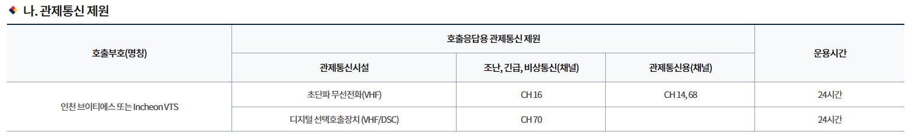

// tag::RadioCallingInPoint[]
===== Remark

* span:F[Radio Calling In Point]는 선박이 위치를 보고하는 지점으로, 주로 해상교통관제(VTS)에서 사용됨
* span:A[feature name] 속성은 보고지점을 지정한 주체의 이름을 입력 +
  단, VTS 센터의 경우 'VTS'는 입력하지 않음 (예: '완도 VTS' → '완도')
* span:A[traffic flow]와 span:A[orientation value]로 선박이 보고하는 시점을 나타냄
** 진입 또는 진출 어느 한 시점에만 보고하는 경우 span:A[traffic flow] = 1 span:D[inbound] 또는 2 span:D[outbound]로 구분하여 입력하고, span:A[orientation value]에 진행 방향을 입력
** 진입/진출 시 모두 보고해야 하는 경우 span:A[traffic flow] = 4 span:D[two-way]로 입력하고, span:A[orientation value]에 해당 방향을 입력 (입/출 방향이 정확히 반대인 경우, 180° 미만의 값을 입력)
** 통항흐름이 분기하는 경우에는, span:A[orientation value] 값을 2개 입력해서 각 분기 방향을 나타냄
* 통신 채널은 span:A[communication channel] 또는 이와 연관된 span:F[Contact Details] 피처에 입력
** 통신 채널을 입력할 때, 동일한 채널을 사용하는 span:F[Radio Calling In Point]가 하나만 있는 경우, span:A[communication channel]에 채널을 입력
** 동일한 채널을 사용하는 span:F[Radio Calling In Point]가 여러 개 있는 경우, span:F[Contact Details] 피처에 속성 span:A[communication channel]에 채널을 입력하고, span:F[Radio Calling In Point]와 span:F[Contact Details] 간 연관관계를 설정

//
* VTS와 같은 관제구역이 있다면, 관제 구역은 span:F[Vessel Traffic Service Area]로 입력하고, span:F[Radio Calling In Point]는 관제구역의 경계에 위치하도록 입력
** 이 때, span:F[Radio Calling In Point]의 span:A[feature name] 속성은 span:F[Vessel Traffic Service Area]의 span:A[feature name] 속성과 동일하게 입력

//REVIEW: 관계참조 추가 및 상세 입력방안 지침 필요
//REVIEW: 피처에 직접 입력하는 경우는 아예 버릴까?

===== Example

.Radio Calling in Point - 별개의 관제구역이 서로 맞닿는 구역에서의 인코딩 예시
====

* 완도 VTS 의 경우
+
.Radio Calling In Point - 완도 VTS
[cols="30,25,10,10,25", options="header"]
|===
|Attribute |Acronym |Type |Mult. |Value 

|communication channel|COMCHA|TE|0,*| [VHF0010]
|**feature name**||C|0,*|
|    span:E[language]||(S)TE|1,1| eng
|    span:E[name]|OBJNAM/NOBJNM|(S)TE|1,1| Wando VTS
|    name usage||(S)EN|0,1| 1 span:D[default name display]
|**feature name**||C|0,*|
|    span:E[language]||(S)TE|1,1| kor
|    span:E[name]|OBJNAM/NOBJNM|(S)TE|1,1| 완도 VTS
|    name usage||(S)EN|0,1| 2 span:D[alternate name display]
|orientation value|ORIENT|RE|0,2|110
|span:E[traffic flow]|TRAFIC|EN|1,1| 1 span:D[inbound]

|===
+
.Contact Details - 완도 VTS
[cols="30,25,10,10,25", options="header"]
|===
|Attribute |Acronym |Type |Mult. |Value 

|call sign|CALSGN|TE|0,1| Wando VTS
|communication channel|COMCHA|TE|0,*| [VHF0010]
|**information**|INFORM|C|0,*|
|    file locator||(S)TE|0,1|
|    file reference|TXTDSC/NTXTDS|(S)TE|0,1|
|    headline||(S)TE|0,1|
|    span:E[language]||(S)TE|1,1|
|    text|INFORM/NINFOM|(S)TE|0,1|

|===

---

* 진도 VTS의 경우
+
.Radio Calling In Point - 진도 VTS
[cols="30,25,10,10,25", options="header"]
|===
|Attribute |Acronym |Type |Mult. |Value 

|communication channel|COMCHA|TE|0,*| [VHF0010]
|**feature name**||C|0,*|
|    span:E[language]||(S)TE|1,1| eng
|    span:E[name]|OBJNAM/NOBJNM|(S)TE|1,1| Jindo VTS
|    name usage||(S)EN|0,1| 1 span:D[default name display]
|**feature name**||C|0,*|
|    span:E[language]||(S)TE|1,1| kor
|    span:E[name]|OBJNAM/NOBJNM|(S)TE|1,1| Jindo VTS
|    name usage||(S)EN|0,1| 2 span:D[alternate name display]
|orientation value|ORIENT|RE|0,2|290
|span:E[traffic flow]|TRAFIC|EN|1,1| 1 span:D[inbound]

|===
+
.Contact Details - 진도 VTS
[cols="30,25,10,10,25", options="header"]
|===
|Attribute |Acronym |Type |Mult. |Value 

|call sign|CALSGN|TE|0,1| Jindo VTS
|communication channel|COMCHA|TE|0,*| [VHF0067]

|===

====

비고:: 호출부호(명칭)은 VTS 센터별로 확인된 명칭을 사용
* https://kcg.go.kr/kcg/si/sub/info.do?page=2836&num=01&mi=2836[참고: 해양경찰청 전국VTS센터]
* 각 센터별 관제통신 제원의 호출부호 또는 명칭을 영문으로 입력

.[참고] 관제통신 제원 예시 - 인천 VTS

---
// end::RadioCallingInPoint[]

featureName의 name은 designator 의 이름을 넣어야 하는게 표준상 내용
그럼 지금 처럼 진도연안 , 완도 두 개를 한꺼 번에 넣을게 아니고
각각으로 나뉘어야 함
