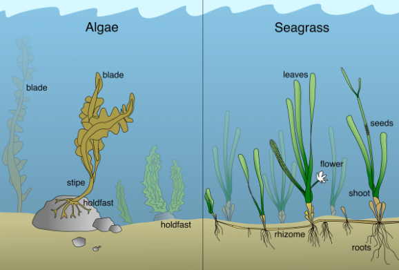

// tag::Seagrass[]
===== Remark
* 조류강(algae)에 속하는 해조류만 span:F[Weed/Kelp]로 입력 ( 좁은 잎을 갖고 빽빽한 수중초원을 형성하는 외떡잎식물은 span:F[Seagrass]로 입력 )
* 해조류가 존재한다는 것은 일반적으로 수중에 바위도 있음을 뜻함

.해조류(Algae)와 해초(Seagrass)의 차이

===== Example
.Seagrass의 인코딩 예시
[cols="30,25,10,10,25", options="header"]
|===
|Attribute |Acronym |Type |Mult. |Value
|-|-|-|-|-
|===

---
// end::Seagrass[]
