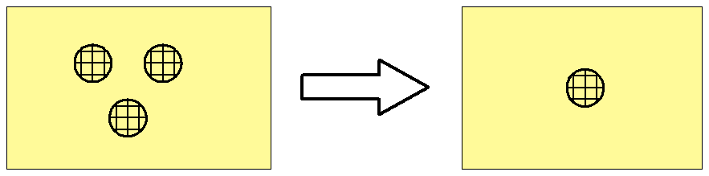

// tag::SiloTank[]
===== Remark
* span:F[Silo/Tank]는 가급적 Surface 로 인코딩 //REVIEW: 이런 언급이 있는 이유가? 우리 INT2에서 정하고 있는 것에는 Point 유형의 $SCODE 밖에 없는데?

//
* span:F[Silo/Tank]의 종류, 저장물 등에 따라 span:A[category of silo/tank], span:A[product]를 입력
** span:A[product]로 표현할 수 없는 저장물의 경우 span:A[information]을 사용하여 상세 정보를 입력

//
* (소축척의 해도에서) 가독성을 위해 여러 개의 span:F[Silo/Tank]를 하나의 객체로 인코딩하고, span:A[multiplicity of features] 의 하위 속성을 다음과 같이 입력할 수 있음
** span:A[multiplicity known] = true 로 설정하고, span:A[number of features]로 개수 입력 span:D[이 때, 개수는 반드시 1 이상이어야 함]
** 만일, 일정 목적으로 모여 있는 사일로/탱크의 집합은 span:F[Production/Storage Area]로 인코딩하고, span:F[Silo/Tank]는 그 안에 속하는 개별 사일로/탱크로 입력할 수 있음

**span:E[주의]**:: span:F[Silo/Tank]가 해상에 있는 경우, ECDIS의 **Base Display** 설정에서 보일수 있도록 span:A[in the water]를 반드시 true로 입력해야 함

.여러 개의 span:F[Silo/Tank]를 하나의 객체로 인코딩하는 경우

.울산항 탱크 터미널 

.span:F[Silo/Tank]의 span:A[category of silo/tank] 및 span:A[product] 입력 예
[%header,cols="a,a,a,a"]
|===
|사일로/탱크의 종류/저장물 분류|category of silo/tank|product|비고

// 1
|대형 곡물 창고
|3 span:D[grain elevator]
|22 span:D[grain]
| 

// 2
|(일반적인) 사일로
|1 span:D[silo in general]
| 
|

// 3
|(일반적인) 탱크
|2 span:D[tank in general]
|
|

// 4
|급수탑
|4 span:D[water tower]
|3 span:D[water] or +
8 span:D[drinking water]
| 식수(청수) 급수탑의 경우 span:A[product] = 8 span:D[drinking water]로 입력 +
그 외의 경우 span:A[product] = 3 span:D[water]로 입력

|===

===== Example

.Silo/Tank 인코딩 예시
[cols="30,25,10,10,25", options="header"]
|===
|Attribute |Acronym |Type |Mult. |Value

|category of silo/tank|CATSIL|EN|0,1| 1 span:D[silo in general]
|product|PRODCT|EN|0,*| 
|in the water| |BO|0,1|

|===

---
// end::SiloTank[]
