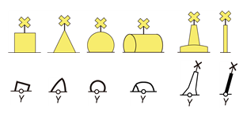

// tag::SpecialPurposeGeneralBuoy[]

.일반기준
- 특수부표는 항해를 지원하기 위한 목적이 아니며 보통 공사나 특별한 시설 등을 표시하는 용도로 사용
- 부표모양은 여러 형태가 존재하며, 두표모양은 기본적으로 한 개의 X자 형태이나 없거나 일부 다른 경우도 있음.
- 일반적으로 황색으로만 구성되나 일부 경우 백색 또는 색상 조합으로 사용됨.
- 특수부표에 설치되는 등화는 다른 입표들이 사용하는 리듬을 제외한 모든 형식 사용가능.
- 속성 [Vertical Length]는 지면상 높이에서 구조물 최상단의 높이를 입력 (구조물 자체만의 높이 – 등대표에 제시됨)
- 특수부표가 Light 객체와 함께 입력되어 등부표로 표현되는 경우 해당 등대번호는 Light객체에 입력 +
   (등부표로 형성된 경우 등대번호가 특수부표의 [INFORM]에 입력되어 있을 경우 수정필요)
- 부표와 등화, 무신호, 레이더비콘, 라디오비콘 등 입표와 부속된 피처들이 있다면 {Structure/Equipment} 관계 설정 +
  ※ Relation 페이지 참조
 - 부표와 두표의 항행통보 번호가 다를 경우 최신의 항행통보 정보 하나만 입력

[cols="1,1" , frame=none , grid=none]
|===
a|
[cols="1,4", options="header"]
!===
!색상 ! 황색 
!부이모양 ! 원통형, 원추형, 구형, 통형, 망대형, 원주형
!두표 !한 개의 X자 형
!등화 !황색
!리듬 !방위표지, 고립장애표지, 안전수역표지 리듬을 제외한 모든 것
!===
a|

|===

.입력예시
[cols="1,1" options="header"]
|===
|Attribute | Value
|Buoy Shape | 4: pillar
|Category of Special Purpose Mark | 18: notice mark
|Colour | 6(yellow)
|Colour Pattern | 2:vertical stripes(대부분 없음음)
|Radar Conspicuous | false
2+h|**Feature Name**
|    Name Usage|1 : default name display
|    Language|eng
|    Name|Hajodo No D
2+h|**Feature Name**
|    Name Usage|2 : alternate name display
|    Language|kor
|    Name|하조도 송공D호
|Status | 7:temporary
|Vertical Length | 0.9(대부분 없음)
2+h|**Information**
|    Language| eng
|    Text| 추가정보(영문)
2+h|**Information**
|    Language| kor
|    Text| 추가정보(국문)
2+h|**Topmark**
|    Colour| 6: yellow
|    Topmark/Daymark Shape|7: x-shaped
|===
// end::SpecialPurposeGeneralBuoy[]
