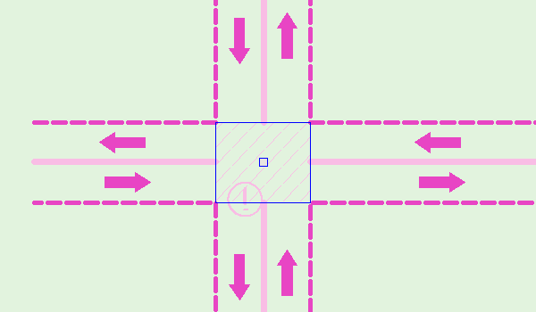

// tag::TrafficSeparationSchemeCrossing[]
===== Remark
* 통항분리제도가 적용되는 수역 중 선박이 횡단할 수 있는 구역을 의미
** 아래 그림과  같이 교차하는 항로가 교차하는 부분에만 span:F[Traffic Separation Scheme Crossing]을 입력해야 함
** span:F[Traffic Separation Scheme Crossing]은 통항분리제도를 구성하는 요소 중 다음 요소들과 중첩되어서는 안됨 span:D[그림의 파란색 선 부분만 입력]
*** span:F[Traffic Separation Scheme Lane Part]
*** span:F[Traffic Separation Scheme Roundabout]
*** span:F[Separation Zone or Line] span:D[Surface 형태의 경우]

.Traffic Separation Scheme Crossing의 예

//
* span:F[Traffic Separation Scheme Crossing]은 다른 구성요소와 함께 span:F[Traffic Separation Scheme]과 span:R[Traffic Separation Scheme Aggregation] 관계를 가져야 함 (<<TSS_AGGR,※참고>>)

//
* 횡단구역에 관한 항행 제한사항이 있다면, span:A[restriction]을 이용하여 입력 할 수 있음
** 단, 중첩되는 span:F[Restricted Area]에 동일한 제한사항에 대해 입력되어 있다면, span:F[Traffic Separation Scheme Crossing]에는 span:A[restriction]을 생략함

===== Example
.Traffic Separation Scheme Crossing의 인코딩 예시
[cols="30,25,10,10,25", options="header"]
|===
|Attribute |Acronym |Type |Mult. |Value

|scale minimum|SCAMIN|IN|0,1| span:D[Traffic Separation Aggregation에 포함되는 다른 구성요소와 동일한 값]

|===

---
// end::TrafficSeparationSchemeCrossing[]
