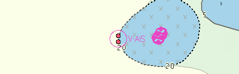
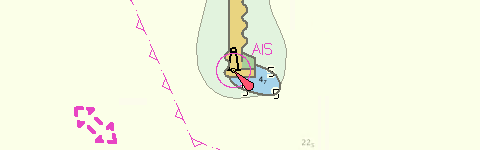
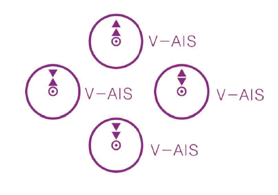
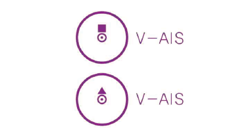

// tag::VirtualAISAidToNavigation[]
===== Remark

* 실제 물리적 장치에 의해 신호를 발사하는 span:F[Physical AIS AidToNavigation]과는 구분해야 함

//REVIEW: Sythetic 과 구분? 항로표지 없이 단독으로 사용되는 Virtual AIS만?
* 국내 제작지침에 따라 span:F[Physical AIS AidToNavigation]는 더 이상 입력하지 않지만, span:F[VirtualAISAidToNavigation]에 대해서는 입력

.V-AIS 와 입력예시
====

.등대표의 V-AIS
[%header, cols="a,a,a,a,a,a,a,a,a"]
|===
^| 번&emsp;호 ^| 해안구분 ^| 명&emsp;칭 ^| 위&emsp;치 ^| MMSI ^| 주파수(MHz) ^| 출력(W) ^| 측정 구역(M) | 기&emsp;사

<.^| 4630
<.^| 서해안
<.^| Virtual +
NACHIDO_ROCK
>.^| 36-30.69N +
126-08.87E
^.^| 994406032
^.^| 16K0F1D +
161.975 +
162.025
^.^| 12.5
^.^| -
<.^| 3분 주기 발사

|===

.전자해도 입력 예시

====

* 단, V-AIS라 하더라도 명칭 또는 좌표를 확인하여 **고정된 물표와 함께 사용되는 Synthetic V-AIS는 입력하지 않음**

.Sythetic V-AIS와 입력 예시
====

.등대표의 Synthetic V-AIS(고정된 물표와 함께 사용되는 V-AIS)
[%header, cols="a,a,a,a,a,a,a,a,a"]
|===
^| 번&emsp;호 ^| 해안구분 ^| 명&emsp;칭 ^| 위&emsp;치 ^| MMSI ^| 주파수(MHz) ^| 출력(W) ^| 측정 구역(M) | 기&emsp;사

<.^| 4451.46 +
M4410.94
<.^| 동해안
<.^| 영일만항 +
남방파제 북단 등대 +
Yeongilman Hang
>.^| 36-05.47N +
129-27.23E
^.^| 994403592
^.^| 16K0F1D +
161.975 +
162.025
^.^| 12.5
^.^| -
<.^| 3분 주기 발사 +
Virtual AIS

|===

.전자해도 입력 예시
 

====

//REVIEW: 굳이 이 말이 필요한가?
// * 상시 운용되거나 정해진 기간 동안 사용될 경우에만 인코딩 (비정기적 또는 단기간 이동 및 제거되는 것이 업데이트로 배포되기 어려울 경우 인코딩하지 않음)

* V-AIS의 기능(설치 목적)에 따라 span:A[virtual AIS aid to navigation type] 를 입력해야 함 ( <<V-AIS_T1, [표 - V-AIS 유형]>> 참고 )
** 등대표나 항행통보 또는 간행된 해도등을 확인하여 V-AIS의 기능을 반드시 입력

//
* MMSI(Maritime Mobile Service Identity; 해상이동업무식별번호)를 알 수 있는 경우, span:A[MMSI Code]에 입력 (9자리 숫자)
** [참고] - 일반적으로 MMSI 코드는 아래와 같은 형식으로 부여할 것을 권고하고 있음; Recommendation ITU-R M.585 (Section 4) +
*** Physical AIS AtoN : 99MID1XXX
*** Virtual AIS AtoN : 99MID6XXX

//REVIEW: 이것도 삭제?
// * 항로표지와 결합하여 사용되는 경우 해당 항로표지와 span:R[Structure/Equipment] 관계 설정 (Sythetic AIS)

[[V-AIS_T1]]
.V-AIS 유형
[%header, cols="a,a,a"]
|===
^| 심볼 
^| 설명 
^| 입력해야 하는 속성

^.^| 
| IALA에 규정된 기능이 알려지지 않은 가상 AIS 항로표지
| span:A[virtual AIS aid to navigation type] = 11 span:D[special purpose] +
span:A[information]에 기능에 대한 설명을 입력

.4+^.^| 
| 북방위표지 (두표 ▲▲)
| span:A[virtual AIS aid to navigation type] = 1 span:D[north cardial]

| 동방위표지 (두표 ▲▼)
| span:A[virtual AIS aid to navigation type] = 2 span:D[east cardial]

| 남방위표지 (두표 ▼▼)
| span:A[virtual AIS aid to navigation type] = 3 span:D[south cardial]

| 서방위표지 (두표 ▼▲)
| span:A[virtual AIS aid to navigation type] = 4 span:D[west cardial]

.2+^.^| 
| 좌현 측방표지 (두표 ■) [IALA B]
| span:A[virtual AIS aid to navigation type] = 7 span:D[port lateral(IALA B)]

| 우현 측방표지 (두표 ▲) [IALA B]
| span:A[virtual AIS aid to navigation type] = 8 span:D[starboard lateral(IALA B)]

^.^| 
| 고립장애표지
| span:A[virtual AIS aid to navigation type] = 9 span:D[isolated danger]

^.^| 
| 안전수역표지
| span:A[virtual AIS aid to navigation type] = 10 span:D[safe water]

^.^| 
| 특수표지
| span:A[virtual AIS aid to navigation type] = 11 span:D[special purpose] +
span:A[information]에 기능에 대한 설명을 입력

|===

===== Example
.Virtual AIS Aid To Navigation의 인코딩 예시
[cols="30,25,10,10,25", options="header"]
|===
|Attribute |Acronym |Type |Mult. |Value
|estimated range of transmission|ESTRNG|RE|0,1| 25
|**feature name**||C|0,*|
|    span:E[language]||(S)TE|1,1| eng
|    span:E[name]|OBJNAM/NOBJNM|(S)TE|1,1| NACHIDO_ROCK
|    name usage||(S)EN|0,1| 1 span:D[default name display]
|mmsi code||TE|0,1| 994406032
|span:E[virtual ais aid to navigation type]||EN|1,1| 9 span:D[isolated danger]
|===

---
// end::VirtualAISAidToNavigation[]
